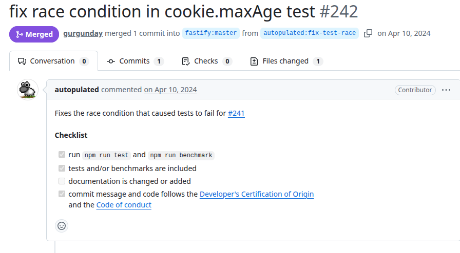
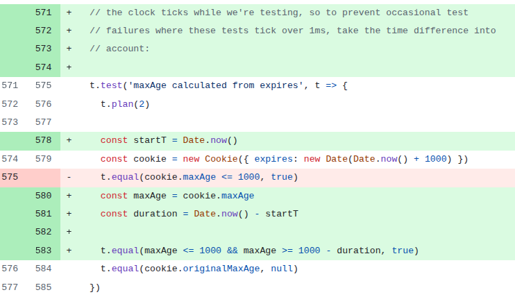

# Session
PR URL: https://github.com/fastify/session/pull/242

## Pull Request Title and Description


## Pull Request Code


## Our Pattern Classification

## Wang Pattern Classification

## Setup
```
git clone https://github.com/fastify/session.git
cd session
git checkout -f c220026c442449e1bea8aeca616b26424d2655f5

nvm use 22
npm install
npm test
```

## Reported flaky tests
```
npx tap test/cookie.test.js -g "maxAge calculated from expires" --no-coverage
```

## Utlized config on run-tests.py
```
# ============= CONFIGS =============
PROJECT_ROOT = "projects/session"
LOG_DIRECTORY = "PRs/pr1363/logs_session"
TOTAL_RUNS = 1000
LOG_INTERVAL = 20

COMMAND = [
    'npx', 'tap', "test/cookie.test.js", "-g", "-maxAge calculated from expires", "--no-coverage"
    # 'npx', 'tap', 
    # 'test/cookie.test.js', '-g ',
    # '-maxAge calculated from expires',
    # '--no-coverage'
]
# ===================================
```