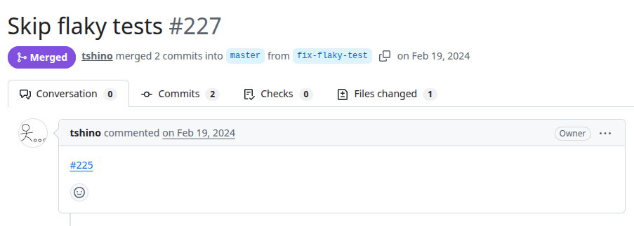
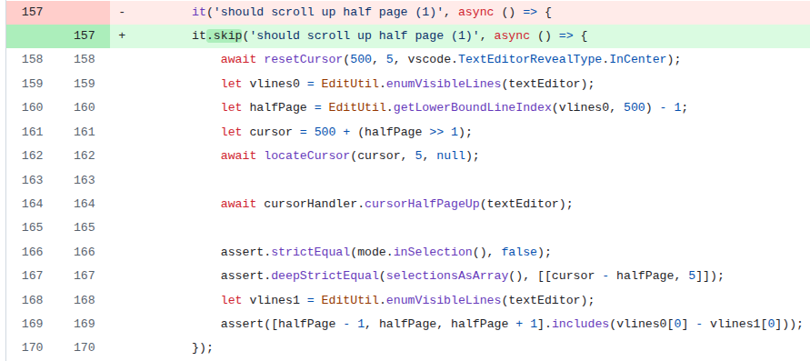

# Vscode-vz-like-keymap
PR URL: https://github.com/tshino/vscode-vz-like-keymap/pull/227

## Pull Request Title and Description


## Pull Request Code


## Our Pattern Classification

## Wang Pattern Classification

## Setup
```
git clone https://github.com/tshino/vscode-vz-like-keymap.git
cd vscode-vz-like-keymap/
git checkout -f b31dd229c6765a54d3a83a4607767d6e82cf8f02

nvm use 18
npm ci
npm run build --if-present

(execute the generic tests)
npm test

(setup and execute the test suite that has our flaky test)
npm run test_with_vscode

(Go to test_with_vscode/suite/cursor_commands.test.js in line 157 and add .only to the test)
it.only('should scroll up half page (1)', async () => {

(Go to test_with_vscode/suite/index.js and comment lines 35 and 75-78 to remove the coverage)
//const nyc = await setupCoverage();
...
// if (nyc) {
//     nyc.writeCoverageFile();
//     await nyc.report();
// }

(And comment line 40 so the colors dont disturb the logs)
// color: true
```

## Reported flaky tests
```
npm run test_with_vscode
```

## Utlized config on run-tests.py
```
# ============= CONFIGS =============
PROJECT_ROOT = "projects/vscode-vz-like-keymap"
LOG_DIRECTORY = "PRs/pr1323/logs_vscodelike"
TOTAL_RUNS = 1000
LOG_INTERVAL = 20

COMMAND = [
    'npm', 'run', 
    'test_with_vscode'
]
# ===================================
```