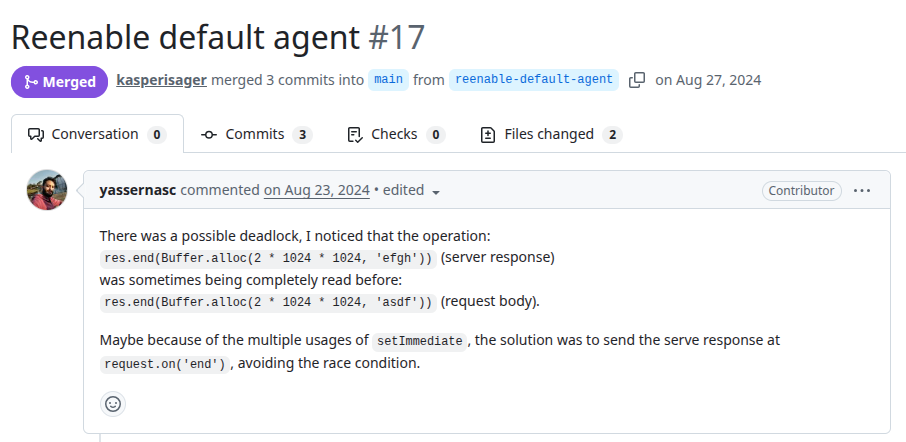
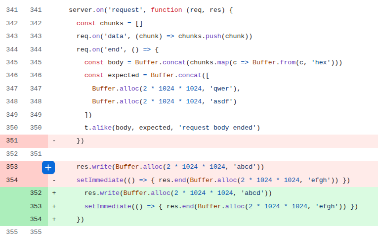

# Bare-http1 
PR URL: https://github.com/holepunchto/bare-http1/pull/17

## Pull Request Title and Description


## Pull Request Code


## Our Pattern Classification
Lifecycle Race: 
The issue arises from an incorrect ordering between different phases of the request–response lifecycle in a Node.js HTTP server.
Specifically, the server begins sending the response (res.write / res.end) before the request body has been fully received and processed (req.on('end')). Due to asynchronous scheduling (e.g., via setImmediate), the response completion may occur before the request stream finishes emitting all its data. This creates a race condition between the request consumption phase and the response finalization phase, which are both part of the server’s lifecycle management.

## Wang Pattern Classification
Order Violation:
The root problem is that two logically dependent events: (1) the completion of request body processing and (2) the sending of the full response, are executed without enforcing the intended order between them. The correct behavior requires that the request be fully received and processed before the response is finalized. However, due to asynchronous execution and the use of setImmediate, the response completion can occur prematurely.

## Setup
```
git clone https://github.com/holepunchto/bare-http1.git
cd bare-http1
git checkout -f 62eb0ffe5bd187554272684edc24ff23a3e748de

nvm use 22
npm install -g bare-runtime
npm i
npm test
```

## Reported flaky tests
```
(comment all the tests in test.js but "server and client do big writes" and the auxiliar functions)
```

## Utlized config on run-tests.py
```
# ============= CONFIGS =============
PROJECT_ROOT = "projects/bare-http1"
LOG_DIRECTORY = "PRs/pr1529/logs_barehttp1"
TOTAL_RUNS = 1000
LOG_INTERVAL = 20

COMMAND = [
    'npm', 'test'
]
# ===================================
```