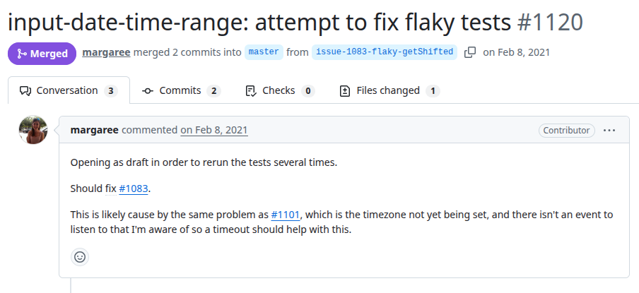
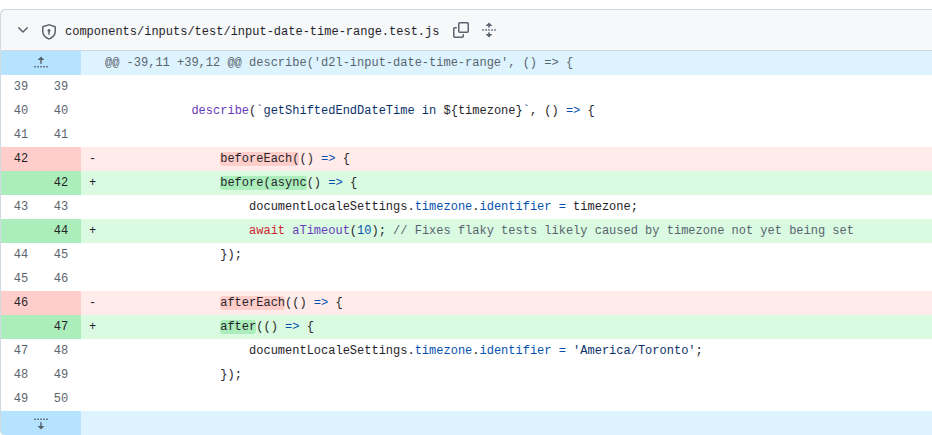

# Core
PR URL: https://github.com/BrightspaceUI/core/pull/1120

## Pull Request Title and Description


## Pull Request Code


## Our Pattern Classification
**Stabilization Race:**
The flakiness arises from insufficient time being allowed for the system state to stabilize before executing dependent logic.

In this case, the test updates the timezone configuration (`documentLocaleSettings.timezone.identifier`) and immediately invokes the function `getShiftedEndDateTime`, which relies on this updated timezone to compute correct results. Although the assignment itself is synchronous, its propagation, likely through the underlying UI framework (e.g., Lit), occurs asynchronously. As a result, the system may not yet reflect the updated timezone when the function is executed, leading to intermittent test failures.

The absence of an explicit event or callback signaling that the timezone change has been fully applied exacerbates this issue. The introduced fix (`await aTimeout(10)`) artificially delays execution, allowing enough time for the asynchronous propagation of the timezone change to complete. This ensures that the system reaches a stable and consistent state before the test logic runs, which is the defining characteristic of a Stabilization Race.

## Wang Pattern Classification
**Order Violation:**
The core problem lies in the lack of enforced ordering between two dependent operations: (1) updating the timezone configuration and (2) executing a function that depends on that configuration. The intended behavior requires that the timezone update be fully applied and observable before the function is called. However, due to asynchronous propagation, the function may execute before the update has taken effect.

## Setup
```
git clone https://github.com/BrightspaceUI/core.git
cd core
git checkout -f 4f483a3d455a46baa80c5eba3fa31d1ec5b2d5b8

nvm use 10
npm install
npm run build
npm start
npm test
```

## Reported flaky tests
```
go to components/inputs/test/input-date-time-range.test.js

add .only at describe.only('utility', () => { in line 36
```

## Utlized config on run-tests.py
```
# ============= CONFIGS =============
PROJECT_ROOT = "projects/core"
LOG_DIRECTORY = "PRs/pr378/logs_core"
TOTAL_RUNS = 1000
LOG_INTERVAL = 20

COMMAND = [
    'npx', 'karma', 'start'
]
# ===================================
```