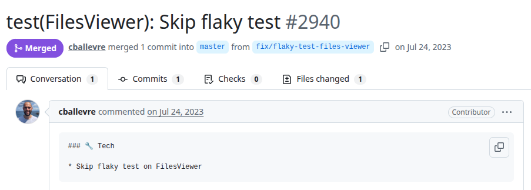
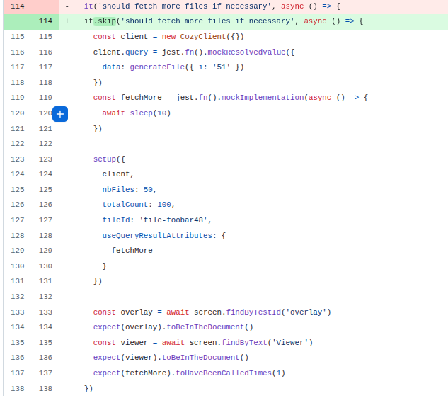

# Cozy-drive
PR URL: https://github.com/cozy/cozy-drive/pull/2940

## Pull Request Title and Description


## Pull Request Code


## Our Pattern Classification
Stabilization Race:

## Wang Pattern Classification
Order Violation:

## Setup
```
git clone https://github.com/cozy/cozy-drive.git
cd cozy-drive
git checkout -f 6b000507ef2f66f22990b607dafdf564832b8cde

nvm use 22
yarn install
yarn test

(got to file src/drive/web/modules/viewer/FilesViewer.spec.jsx and remove the .skip from test "should fetch more files if necessary")
```

## Reported flaky tests
```
yarn test src/drive/web/modules/viewer/FilesViewer.spec.jsx
```

## Utlized config on run-tests.py
```
# ============= CONFIGS =============
PROJECT_ROOT = "projects/cozy-drive"
LOG_DIRECTORY = "PRs/pr1147/logs_cozydrive"
TOTAL_RUNS = 1000
LOG_INTERVAL = 20

COMMAND = [
    'yarn', 'test',
    'src/drive/web/modules/viewer/FilesViewer.spec.jsx'
]
# ===================================
```