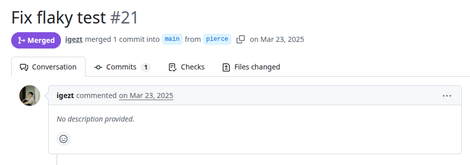
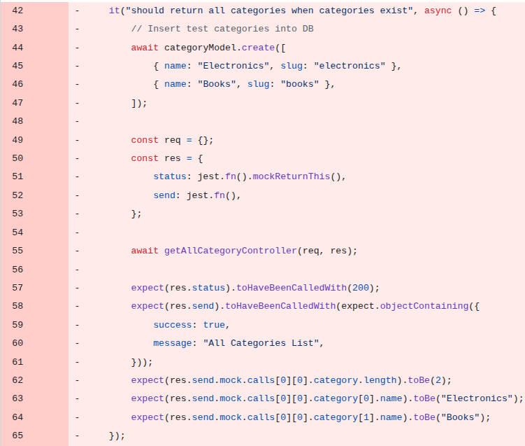
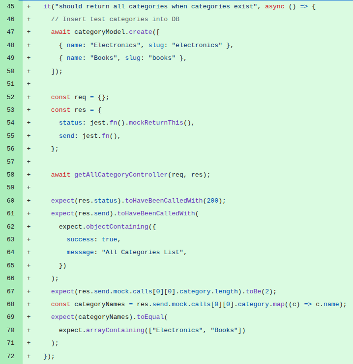

# Cs4218
PR: https://github.com/cs4218/cs4218-2420-ecom-project-team15/pull/21

## Pull Request Title and Description


## Pull Request Code




## Description
The test inserts two categories (“Electronics” and “Books”) and invokes `getAllCategoryController`, expecting the returned list to preserve the insertion order. However, MongoDB does not guarantee document ordering unless an explicit sort operation (ORDER BY) is specified. As a result, the returned categories may appear in different orders across executions.

## Validation Between the Authors
<table>
  <thead>
    <tr>
      <th align="left">Researcher</th>
      <th align="left">Classification</th>
      <th align="left">Bug Pattern</th>
      <th align="left">Rationale</th>
    </tr>
  </thead>
  <tbody>
    <tr>
      <td rowspan="2"><b>R1</b></td>
      <td>Wang</td>
      <td>Order Violation</td>
      <td>The developer intended for a specific ordering in the data retrieved that was not enforced by the database operation.</td>
    </tr>
    <tr>
      <td>Our</td>
      <td>External Nondeterminism</td>
      <td>The test relies on the non-deterministic result ordering of the Mongo database query rather than internal JavaScript logic.</td>
    </tr>
    <tr>
      <td rowspan="2"><b>R2</b></td>
      <td>Wang</td>
      <td>Order Violation</td>
      <td>Expects the categories to come in a pre-defined order.</td>
    </tr>
    <tr>
      <td>Our</td>
      <td>External Nondeterminism</td>
      <td>The order of categories depends on the MongoDB internals.</td>
    </tr>
  </tbody>
</table>

## Setup
```
git clone https://github.com/cs4218/cs4218-2420-ecom-project-team15.git
cd cs4218-2420-ecom-project-team15/
git checkout -f 678635b06cf5b4064772dda6cd9acace62acaa85

nvm use 23
npm install
cd client/
npm install
cd ..
npm run test
```

```
npx jest controllers/integration-tests/categoryControllerPartA.integration.test.js -t "should return all categories when categories exist" --coverage=false

nvm use 22 to use nacd
nacd plain2 npx jest controllers/integration-tests/categoryControllerPartA.integration.test.js -t "should return all categories when categories exist" --coverage=false --testTimeout=50000
```

```
# ============= CONFIGS =============
PROJECT_ROOT = "projects/cs4218-2420-ecom-project-team15"
LOG_DIRECTORY = "logs_cs4218"
TOTAL_RUNS = 1000
LOG_INTERVAL = 20

COMMAND = [
    'npx', 'jest', 
    'controllers/integration-tests/categoryControllerPartA.integration.test.js',
    '-t', 'should return all categories when categories exist',
    '--coverage=false'
]
# ================================================================
```

Obs: To execute the logs using NACD race detection tool, simply install the tool (<https://github.com/andreendo/nacd>), include the commands 'nacd', 'plain2' in front of the COMMAND array and change the TOTAL_RUNS to 100, as following:

```
# ============= CONFIGS =============
PROJECT_ROOT = "projects/cs4218-2420-ecom-project-team15"
LOG_DIRECTORY = "logs_nacd_cs4218"
TOTAL_RUNS = 100
LOG_INTERVAL = 20

COMMAND = [
    'nacd', 'plain2', 'npx', 'jest', 
    'controllers/integration-tests/categoryControllerPartA.integration.test.js',
    '-t', 'should return all categories when categories exist',
    '--coverage=false'
]
# ================================================================
```