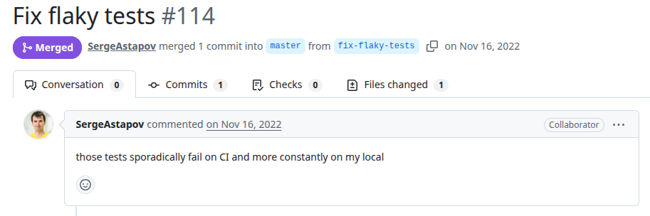
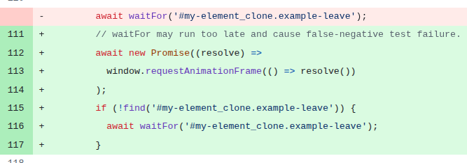

# Ember-css-transitions
PR URL: https://github.com/miguelcobain/ember-css-transitions/pull/114

## Pull Request Title and Description


## Pull Request Code


## Description
In this test, the code relies on `await waitFor('#my-element_clone.example-leave')` to ensure that a DOM element with a specific transition class is present. However, `waitFor` alone seems to not be sufficient to guarantee that the rendering and animation has completed. As noted in the PR, `waitFor` may resolve too late or at an inconsistent point in the rendering cycle, leading to false-negative failures.
The fix introduces an additional synchronization step using `window.requestAnimationFrame`, which ensures that the browser has completed at least one rendering frame before proceeding.

## Validation Between the Authors
<table>
  <thead>
    <tr>
      <th align="left">Researcher</th>
      <th align="left">Classification</th>
      <th align="left">Bug Pattern</th>
      <th align="left">Rationale</th>
    </tr>
  </thead>
  <tbody>
    <tr>
      <td rowspan="2"><b>R1</b></td>
      <td>Wang</td>
      <td>Order Violation</td>
      <td>The intended order was for the asynchronous UI animation to complete before the assertions.</td>
    </tr>
    <tr>
      <td>Our</td>
      <td>Stabilization Race</td>
      <td>The test asserts before the UI component has stabilized and completed its rendering. The fix had to introduce an additional synchronization step to ensure the rendering frame before proceeding.</td>
    </tr>
    <tr>
      <td rowspan="2"><b>R2</b></td>
      <td>Wang</td>
      <td>Order Violation</td>
      <td>The wait may take too long and miss the element, violating the expected order.</td>
    </tr>
    <tr>
      <td>Our</td>
      <td>Stabilization Race</td>
      <td>The timing between the rendering and assert is not right.</td>
    </tr>
  </tbody>
</table>

## Setup
```
git clone https://github.com/miguelcobain/ember-css-transitions.git
cd ember-css-transitions
git checkout -f e0c866630b99ae2397632fd4bcad9e555ff6091d

nvm use 18 #v18.20.8
pnpm i && pnpm i

add .only on test in line 45 from file: test-app/tests/integration/components/css-transition-test.js:
      test(`enter and leave transitions work (${i.name})`, async function (assert) {


pnpm run test
``` 

## Reported flaky tests
```
pnpm --filter '*' test:ember
```

## Utlized config on run-tests.py
```
# ============= CONFIGS =============
PROJECT_ROOT = "projects/ember-css-transitions"
LOG_DIRECTORY = "PRs/pr946/logs_ember"
TOTAL_RUNS = 1000
LOG_INTERVAL = 20

COMMAND = [
    'pnpm', '--filter', 
    '*', 'test:ember'
]
# ===================================
```