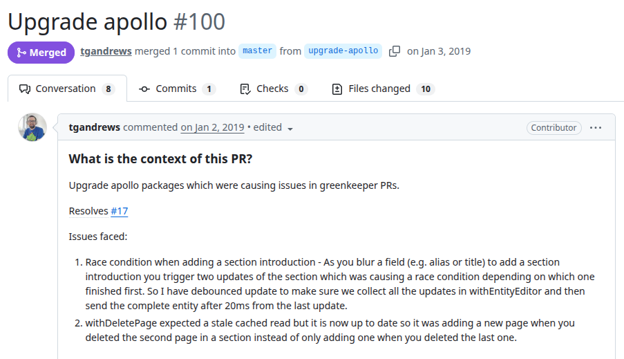
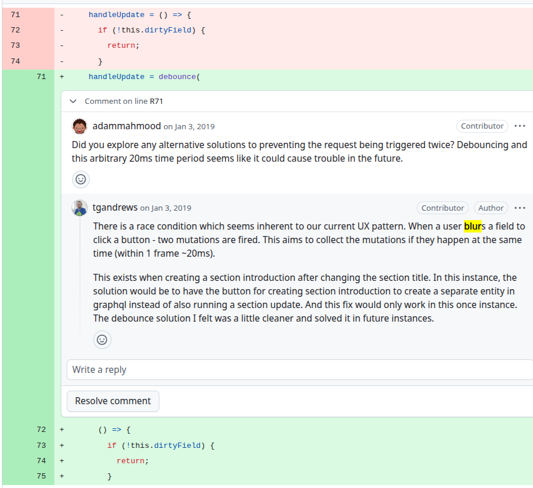
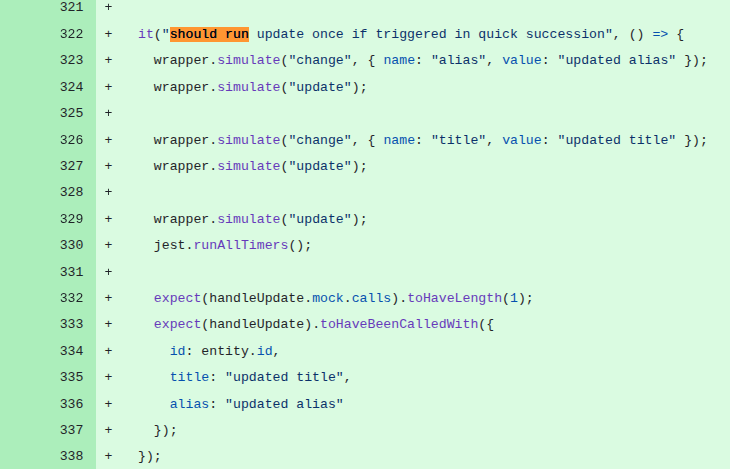

# eq-author
PR URL: https://github.com/ONSdigital/eq-author-app/pull/100

## Pull Request Title and Description


## Pull Request Code




## Description
As described in the PR, when a user blurs a field (alias or title) and simultaneously triggers another UI action, two update operations are fired almost concurrently. Both updates attempt to modify the same underlying entity and are sent as separate requests. With this behavior multiple asynchronous operations are accessing and modifying shared state without synchronization. The fix introduces a debouncing mechanism (`debounce(..., 20ms)`), which aggregates rapid successive updates into a single operation. By delaying execution and coalescing updates within a short time window, the solution prevents overlapping mutations and ensures that only a consolidated, consistent update is sent.

## Validation Between the Authors
<table>
  <thead>
    <tr>
      <th align="left">Researcher</th>
      <th align="left">Classification</th>
      <th align="left">Bug Pattern</th>
      <th align="left">Rationale</th>
    </tr>
  </thead>
  <tbody>
    <tr>
      <td rowspan="2"><b>R1</b></td>
      <td>Wang</td>
      <td>Order Violation</td>
      <td>The intended order was for the earlier asynchronous update to complete before the later one, therefore avoiding the non-deterministic behavior.</td>
    </tr>
    <tr>
      <td>Our</td>
      <td>Concurrent Access Race</td>
      <td>Two overlapping mutations compete to update the same entity without proper coordination.</td>
    </tr>
    <tr>
      <td rowspan="2"><b>R2</b></td>
      <td>Wang</td>
      <td>Order Violation</td>
      <td>There are two updates (mutations, events) and they race with each other, causing the bug. I think it is not atomicity violation because there isn’t a third event that occurs between them.</td>
    </tr>
    <tr>
      <td>Our</td>
      <td>Concurrent Access Race</td>
      <td>Both events try to update the UI (same resource).</td>
    </tr>
  </tbody>
</table>

## Setup
```
git clone https://github.com/ONSdigital/eq-author-app.git
cd eq-author-app/
git checkout -f 3d04709ad2c36b49888e8305b855b34f9da0dd20

nvm use 22
cd eq-author
yarn
yarn test
```

## Reported flaky tests
```
npx jest eq-author/src/components/withEntityEditor/index.test.js

npx jest eq-author/src/components/withEntityEditor/index.test.js --t "should run update once if triggered in quick succession"
should not overwrite fields that are being changed
should use the name to create deeply nested entities
```

## Utlized config on run-tests.py
```
# ============= CONFIGS =============
PROJECT_ROOT = "projects/eq-author-app/eq-author"
LOG_DIRECTORY = "PRs/pr5/logs_eq-author"
TOTAL_RUNS = 1000
LOG_INTERVAL = 20

COMMAND = [
    'npx', 'jest', 
    'eq-author/src/components/withEntityEditor/index.test.js', '--t',
    'should run update once if triggered in quick succession'
]
# ===================================
```