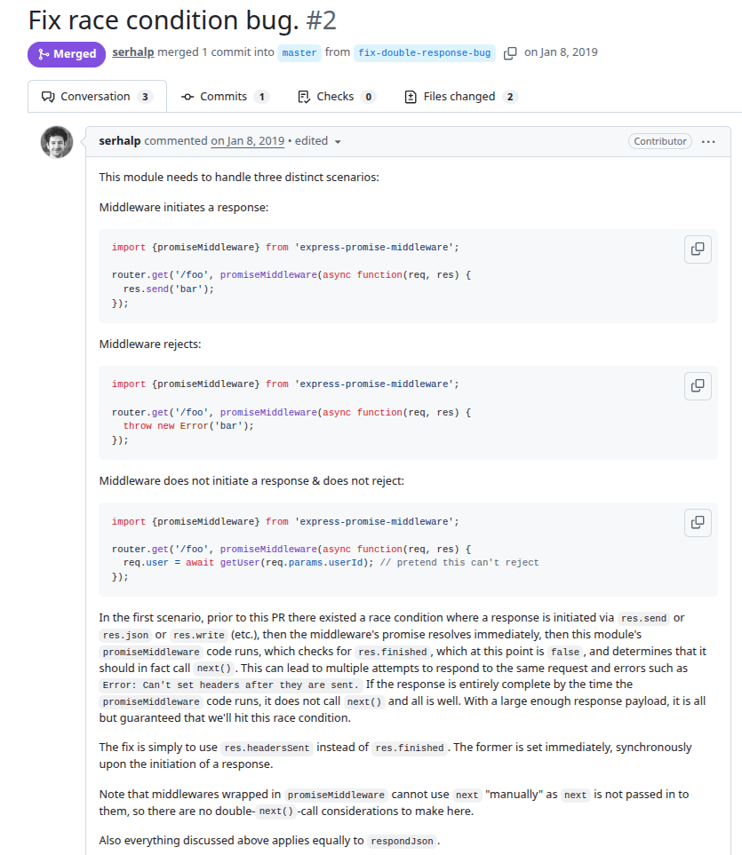
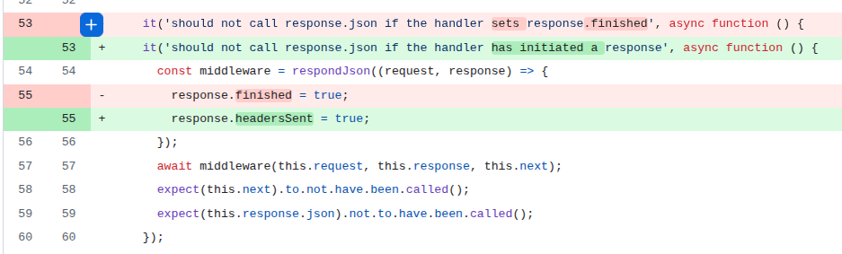

# express-promise
PR URL: https://github.com/goodeggs/express-promise-middleware/pull/2/files

## Pull Request Title and Description


## Pull Request Code


## Description
In the original implementation, the middleware checks the flag `res.finished` to determine whether a response has already been completed. However, sending a response (e.g., via `res.send`) is an asynchronous operation, and there exists a time window where the response has already been initiated but not yet fully completed. During this window, `res.finished` remains false, even though the response is in progress. The fix replaces `res.finished` with `res.headersSent`, which is set at the moment the response is initiated.

## Validation Between the Authors
 <table>
  <thead>
    <tr>
      <th align="left">Researcher</th>
      <th align="left">Classification</th>
      <th align="left">Bug Pattern</th>
      <th align="left">Rationale</th>
    </tr>
  </thead>
  <tbody>
    <tr>
      <td rowspan="2"><b>R1</b></td>
      <td>Wang</td>
      <td>Order Violation</td>
      <td>The intended order was for the response to always finish before the middleware’s check and forced next() call.</td>
    </tr>
    <tr>
      <td>Our</td>
      <td>Stabilization Race</td>
      <td>The test expects the middleware’s response to have finished as soon as the response is sent, leaving little time for the asynchronous response to fully stabilize, which can lead to premature and erroneous calls to next().</td>
    </tr>
    <tr>
      <td rowspan="2"><b>R2</b></td>
      <td>Wang</td>
      <td>Order Violation</td>
      <td>The order expected by the dev is violated.</td>
    </tr>
    <tr>
      <td>Our</td>
      <td>Stabilization Race</td>
      <td>Use some resources (boolean variable) before it is ready (it races before the variable is updated).</td>
    </tr>
  </tbody>
</table>


## Setup
```
git clone https://github.com/goodeggs/express-promise-middleware.git
cd express-promise-middleware/
git checkout -f 385feebe9725197af8934cfe3f0a9602b7636269

nvm use 22
yarn
yarn test
```

## Reported flaky tests
```
npm run test:mocha -- src/test.js --grep "respondJson should not call response.json if the handler sets response.finished"
npm run test:mocha -- src/test.js --grep "respondJson should reject and not call next\(\) with an error if the handler sets response.finished and also rejects"

npm run test:mocha -- src/test.js --grep "promiseMiddleware should return a middleware that calls next when the promise resolves"
npm run test:mocha -- src/test.js --grep "promiseMiddleware should not call next if the handler sets response.finished"
```

## Utlized config on run-tests.py
```
# ============= CONFIGS =============
PROJECT_ROOT = "projects/express-promise-middleware"
LOG_DIRECTORY = "PRs/pr6/express-promise"
TOTAL_RUNS = 1000
LOG_INTERVAL = 20

COMMAND = [
    'npm', 'run', 'test:mocha', 
    '--', 'src/test.js',
    '--grep', 'respondJson should not call response.json if the handler sets response.finished'
]
# ===================================
```