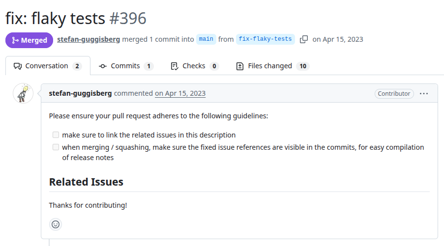
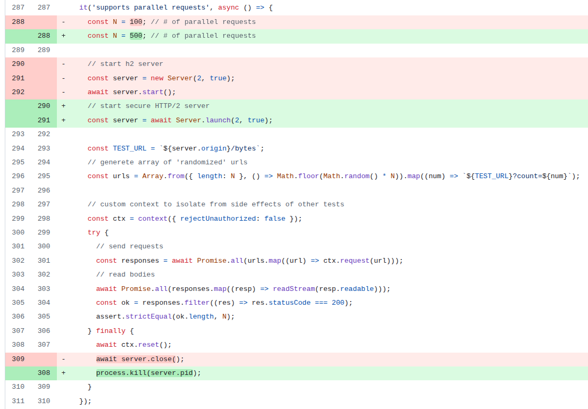

# fetch
PR URL: https://github.com/adobe/fetch/pull/396

## Pull Request Title and Description


## Pull Request Code


## Description

The test creates an HTTP/2 server and performs a large number of parallel requests (`Promise.all` with up to 500 requests). After the test, it attempts to clean up using `server.close()`. However, `server.close()` seems to not guarantee that all underlying connections, sockets, or asynchronous operations are fully terminated before the next test begins. As a result, residual resources (e.g., open ports or active connections) may interfere with subsequent tests, leading to timeouts and unexpected responses (e.g., HTTP 502 instead of 200).
The fix introduces a more forceful teardown using `process.kill`(`server.pid`), ensuring that the server process and all associated resources are completely terminated. This eliminates interference between test runs.

```
=== Test #25 - 2026-04-21 22:16:43 - FAILED ===

  Core Tests
    ✔ supports HTTP/1(.1) (1653ms)
    ✔ supports HTTP/2 (1739ms)
    ✔ throws on unsupported protocol
    ✔ unsupported method (818ms)
    ✔ supports binary response body (Stream) (614ms)
    - supports gzip/deflate/br content encoding (default)
    ✔ supports disabling gzip/deflate/br content encoding (818ms)
    - supports gzip/deflate/br content decoding (default)
    - supports disabling gzip/deflate/br content decoding
    ✔ does not overwrite accept-encoding header (204ms)
    ✔ creating custom context works (984ms)
    ✔ AbortController works (premature abort)
    ✔ AbortController works (premature abort, fresh context)
    ✔ AbortController works (slow response) (1001ms)
    ✔ AbortController works (slow connect) (1001ms)
    ✔ overriding user-agent works (context) (883ms)
    ✔ overriding user-agent works (header) (205ms)
    ✔ forcing HTTP/1.1 works (2355ms)
    ✔ supports parallel requests (55ms)
    ✔ supports json POST (149ms)
    ✔ supports json POST (override content-type) (140ms)
    ✔ supports text body (167ms)
    ✔ supports text multibyte body (205ms)
    ✔ supports buffer body (142ms)
    ✔ supports arrayBuffer body (165ms)
    ✔ supports text body (html) (205ms)
    - supports stream body
    - coerces arbitrary body to string
    ✔ supports URLSearchParams body (205ms)
    ✔ supports spec-compliant FormData body (205ms)
    ✔ supports POST without body (204ms)
    ✔ supports gzip content encoding (207ms)
    ✔ supports deflate content encoding (205ms)
    ✔ supports brotli content encoding (325ms)
    ✔ supports HTTP/2 server push (1781ms)
    1) HTTP/2 server push can be rejected
    ✔ supports timeout for idle pushed streams (1845ms)
    ✔ supports timeout for idle HTTP/2 session (2254ms)


  32 passing (26s)
  5 pending
  1 failing

  1) Core Tests
       HTTP/2 server push can be rejected:
     Error: Timeout of 5000ms exceeded. For async tests and hooks, ensure "done()" is called; if returning a Promise, ensure it resolves. (/home/pedroubuntu/Desktop/GitHub_repo_SBLP/PR_Classifications/Projects/fetch/fetch/test/core/index.test.js)
      at listOnTimeout (node:internal/timers:569:17)
      at process.processTimers (node:internal/timers:512:7)
```

```
=== Test #27 - 2026-04-21 22:17:33 - FAILED ===

  Core Tests
    ✔ supports HTTP/1(.1) (533ms)
    ✔ supports HTTP/2 (1377ms)
    ✔ throws on unsupported protocol
    ✔ unsupported method (776ms)
    ✔ supports binary response body (Stream) (609ms)
    - supports gzip/deflate/br content encoding (default)
    ✔ supports disabling gzip/deflate/br content encoding (920ms)
    - supports gzip/deflate/br content decoding (default)
    - supports disabling gzip/deflate/br content decoding
    ✔ does not overwrite accept-encoding header (204ms)
    ✔ creating custom context works (718ms)
    ✔ AbortController works (premature abort)
    ✔ AbortController works (premature abort, fresh context)
    ✔ AbortController works (slow response) (1001ms)
    ✔ AbortController works (slow connect) (1001ms)
    ✔ overriding user-agent works (context) (739ms)
    ✔ overriding user-agent works (header) (205ms)
    ✔ forcing HTTP/1.1 works (3175ms)
    ✔ supports parallel requests (56ms)
    ✔ supports json POST (250ms)
    ✔ supports json POST (override content-type) (204ms)
    ✔ supports text body (205ms)
    ✔ supports text multibyte body (204ms)
    ✔ supports buffer body (718ms)
    ✔ supports arrayBuffer body (204ms)
    ✔ supports text body (html) (205ms)
    - supports stream body
    - coerces arbitrary body to string
    ✔ supports URLSearchParams body (512ms)
    ✔ supports spec-compliant FormData body (205ms)
    ✔ supports POST without body (205ms)
    ✔ supports gzip content encoding (207ms)
    ✔ supports deflate content encoding (203ms)
    1) supports brotli content encoding
    ✔ supports HTTP/2 server push (1697ms)
    ✔ HTTP/2 server push can be rejected (3580ms)
    ✔ supports timeout for idle pushed streams (1834ms)
    ✔ supports timeout for idle HTTP/2 session (1899ms)


  32 passing (24s)
  5 pending
  1 failing

  1) Core Tests
       supports brotli content encoding:

      AssertionError [ERR_ASSERTION]: Expected values to be strictly equal:

502 !== 200

      + expected - actual

      -502
      +200
      
      at Context.<anonymous> (file:///home/pedroubuntu/Desktop/GitHub_repo_SBLP/PR_Classifications/Projects/fetch/fetch/test/core/index.test.js:540:12)
      at process.processTicksAndRejections (node:internal/process/task_queues:95:5)
```


## Validation Between the Authors
<table>
  <thead>
    <tr>
      <th align="left">Researcher</th>
      <th align="left">Classification</th>
      <th align="left">Bug Pattern</th>
      <th align="left">Rationale</th>
    </tr>
  </thead>
  <tbody>
    <tr>
      <td rowspan="2"><b>R1</b></td>
      <td>Wang</td>
      <td>Order Violation</td>
      <td>The expected order was for the server to completely terminate and release its resources before initiating new servers.</td>
    </tr>
    <tr>
      <td>Our</td>
      <td>Lifecycle Race</td>
      <td>The lifecycle race arises because the original teardown logic (await server.close()) seems to be insufficient to fully release network resources, causing conflicts between the cleanup of one server and its setup in other tests.</td>
    </tr>
    <tr>
      <td rowspan="2"><b>R2</b></td>
      <td>Wang</td>
      <td>Order Violation</td>
      <td>The expected order is that the server finishes before a new test starts.</td>
    </tr>
    <tr>
      <td>Our</td>
      <td>Lifecycle Race</td>
      <td>It modifies the creation and exclusion of the server (object), using lifecycle features of the test framework.</td>
    </tr>
  </tbody>
</table>

## Setup
```
git clone https://github.com/adobe/fetch
cd fetch
git checkout -f 9d3f33f0e92d919bb4d8d1359b8e3e284a385634

nvm use 18
npm ci
npm test

npx c8 mocha
```

## Reported flaky tests
```
npx mocha test/core/index.test.js -g "supports parallel requests"
```

## Utlized config on run-tests.py
```
# ============= CONFIGS =============
PROJECT_ROOT = "projects/fetch"
LOG_DIRECTORY = "PRs/pr1035/logs_fetch"
TOTAL_RUNS = 1000
LOG_INTERVAL = 20

COMMAND = [
    'npx', 'mocha', 
    'test/core/index.test.js',
    '-g', 'supports parallel requests'
]
# ===================================
```