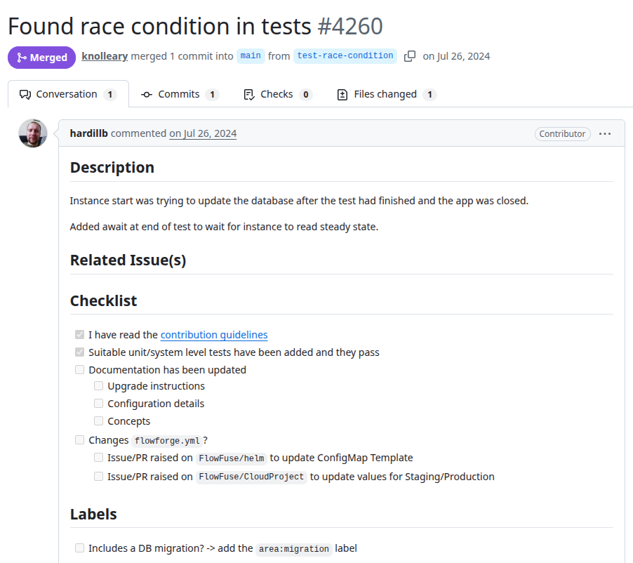
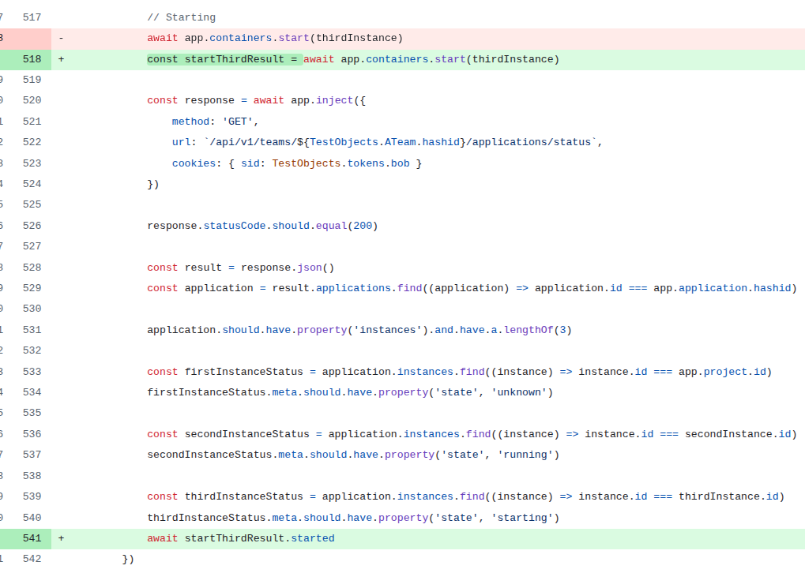

# flowfuse
PR URL: https://github.com/FlowFuse/flowfuse/pull/4260

## Pull Request Title and Description


## Pull Request Code


## Description
In this scenario, the test triggers the startup of multiple instances, including `app.containers.start(thirdInstance)` whose startup process is asynchronous. The test proceeds to validate the application state and completes without awaiting the full resolution of this asynchronous operation.

## Validation Between the Authors
<table>
  <thead>
    <tr>
      <th align="left">Researcher</th>
      <th align="left">Classification</th>
      <th align="left">Bug Pattern</th>
      <th align="left">Rationale</th>
    </tr>
  </thead>
  <tbody>
    <tr>
      <td rowspan="2"><b>R1</b></td>
      <td>Wang</td>
      <td>Order Violation</td>
      <td>The intended order was for the third instance’s asynchronous startup to complete before the test conclusion.</td>
    </tr>
    <tr>
      <td>Our</td>
      <td>Stabilization Race</td>
      <td>The test terminates immediately after the assertions without waiting for the third instance to completely start and stabilize.</td>
    </tr>
    <tr>
      <td rowspan="2"><b>R2</b></td>
      <td>Wang</td>
      <td>Order Violation</td>
      <td>The dev intended order is violated.</td>
    </tr>
    <tr>
      <td>Our</td>
      <td>Stabilization Race</td>
      <td>The code should wait for the resource to be started.</td>
    </tr>
  </tbody>
</table>

## Setup
```
git clone https://github.com/FlowFuse/flowfuse.git
cd flowfuse
git checkout -f 223b40875b49cc4fa7e17f96f843978248aa5862

nvm use 20
npm install
npm run build
npm run test:unit
```

## Reported flaky tests
```
npx mocha 'test/unit/forge/routes/api/team_spec.js' --timeout 10000 --node-option=unhandled-rejections=strict -g 'with all instances and their status'
```

## Utlized config on run-tests.py
```
# ============= CONFIGS =============
PROJECT_ROOT = "projects/flowfuse"
LOG_DIRECTORY = "PRs/pr1510/logs_flowfuse"
TOTAL_RUNS = 1000
LOG_INTERVAL = 20

COMMAND = [
    'npx', 'mocha', 
    'test/unit/forge/routes/api/team_spec.js',
    '--node-option=unhandled-rejections=strict',
    '-g', 'with all instances and their status'
    ]
# ===================================
```