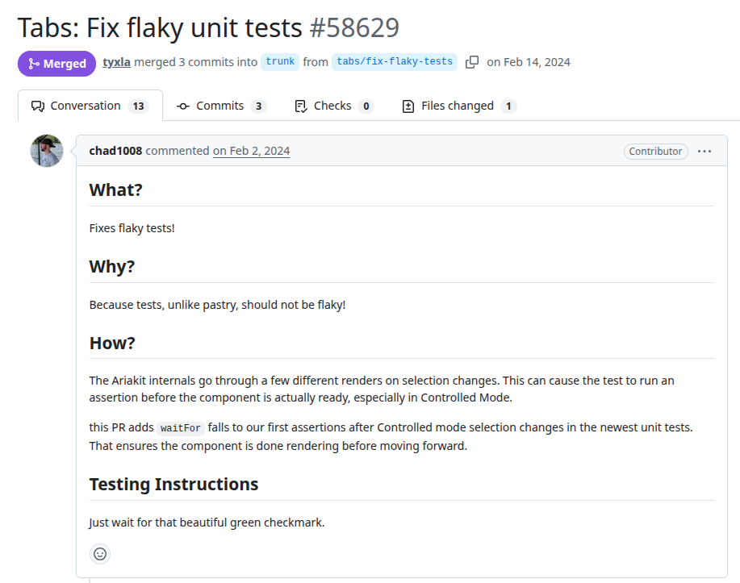
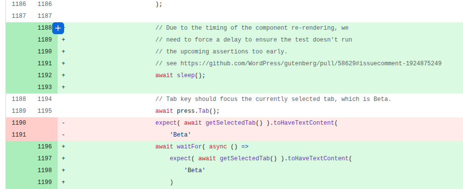

# gutenberg
PR URL: https://github.com/WordPress/gutenberg/pull/58629

## Pull Request Title and Description


## Pull Request Code


## Description
In this case, changes to the `selectedTab` prop in a React component trigger multiple internal re-renders. These re-renders do not complete immediately, and the test proceeds to execute assertions by checking the selected tab and focus state before the component has reached its final state. As a result, the test intermittently fails because it observes intermediate UI states rather than the fully updated one. The fix introduces `waitFor`, which repeatedly evaluates the assertion until the expected condition is met or a timeout occurs.

## Validation Between the Authors
<table>
  <thead>
    <tr>
      <th align="left">Researcher</th>
      <th align="left">Classification</th>
      <th align="left">Bug Pattern</th>
      <th align="left">Rationale</th>
    </tr>
  </thead>
  <tbody>
    <tr>
      <td rowspan="2"><b>R1</b></td>
      <td>Wang</td>
      <td>Order Violation</td>
      <td>The intended ordering was for the selected component to be fully rendered and stable before the test assertions.</td>
    </tr>
    <tr>
      <td>Our</td>
      <td>Stabilization Race</td>
      <td>The test executes assertions on a selected tab from a UI component that has not yet completed its asynchronous rendering, requiring a “waitFor” to ensure stability.</td>
    </tr>
    <tr>
      <td rowspan="2"><b>R2</b></td>
      <td>Wang</td>
      <td>Order Violation</td>
      <td>The order expected by the dev is violated.</td>
    </tr>
    <tr>
      <td>Our</td>
      <td>Stabilization Race</td>
      <td>Assert some resources before it is ready.</td>
    </tr>
  </tbody>
</table>

## Setup
```
git clone https://github.com/WordPress/gutenberg.git
cd gutenberg/
git checkout -f b801b1c15f8daa304ca6f9db0999e35e3088d687

nvm use 20
npm ci
//npm install
//npm run dev
npm test
```

## Reported flaky tests
```
npx jest --config test/unit/jest.config.js packages/components/src/tabs/test/index.tsx -t "should continue to handle arrow key navigation properly" --silent
```

## Utlized config on run-tests.py
```
# ============= CONFIGS =============
PROJECT_ROOT = "projects/gutenberg"
LOG_DIRECTORY = "PRs/pr1304/logs_gutenberg"
TOTAL_RUNS = 1000
LOG_INTERVAL = 20

COMMAND = [
    'npx', 'jest', 
    '--config', 'test/unit/jest.config.js',
    'packages/components/src/tabs/test/index.tsx',
    '-t', 'should continue to handle arrow key navigation properly',
    '--silent'
]
# ===================================
```