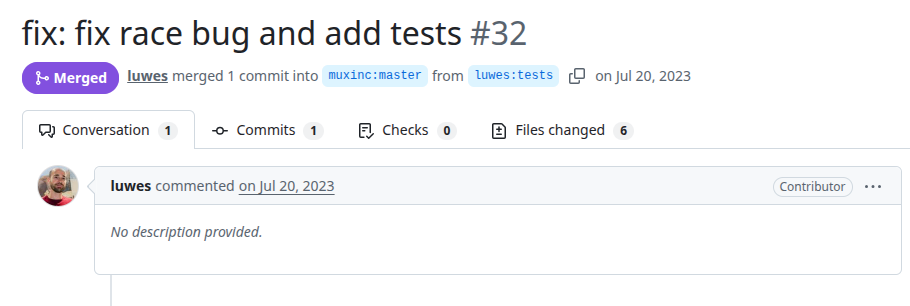
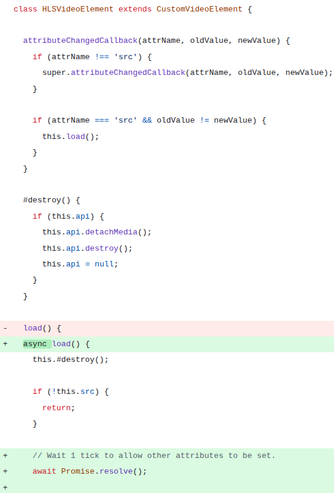
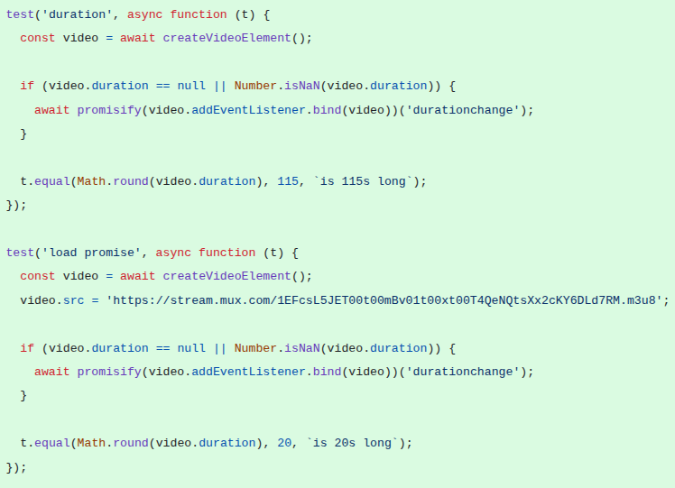

# hls-video-element
PR URL: https://github.com/muxinc/hls-video-element/pull/32

## Pull Request Title and Description


## Pull Request Code




## Description
In this case, when the `src` attribute changes, the `load()` method is triggered, which internally calls `#destroy()` to clean up any existing HLS instance before initializing a new one. However, without proper synchronization, the initialization logic may execute before all relevant attributes are fully applied to the element. The fix introduces an `await Promise.resolve()` to wait for one microtask tick in the `load()` method.

## Validation Between the Authors
<table>
  <thead>
    <tr>
      <th align="left">Researcher</th>
      <th align="left">Classification</th>
      <th align="left">Bug Pattern</th>
      <th align="left">Rationale</th>
    </tr>
  </thead>
  <tbody>
    <tr>
      <td rowspan="2"><b>R1</b></td>
      <td>Wang</td>
      <td>Order Violation</td>
      <td>The intended order was for the teardown of the previous HLS instance to complete before initializing the new one.</td>
    </tr>
    <tr>
      <td>Our</td>
      <td>Lifecycle Race</td>
      <td>The load method tries to initiate a new setup immediately after using #destroy to teardown old instances, but not ensuring the teardown is fully completed before the new initialization.</td>
    </tr>
    <tr>
      <td rowspan="2"><b>R2</b></td>
      <td>Wang</td>
      <td>Order Violation</td>
      <td>The expected order of setting attributes is violated.</td>
    </tr>
    <tr>
      <td>Our</td>
      <td>Lifecycle Race</td>
      <td>It involves lifecycle issues.</td>
    </tr>
  </tbody>
</table>

## Setup
```
git clone https://github.com/muxinc/hls-video-element.git
cd hls-video-element
git checkout -f 0fcd2f848465fc8bde99dd9a6f3a560988f5d016

nvm use 22
yarn --frozen-lockfile
yarn test
```
go to hls-video-element.js in lines 24 and 32
```
- async load() {
+ load() {

...

// Wait 1 tick to allow other attributes to be set.
- await Promise.resolve();
```

## Reported flaky tests
```
yarn test
```

## Utlized config on run-tests.py
```
# ============= CONFIGS =============
PROJECT_ROOT = "projects/hls-video-element"
LOG_DIRECTORY = "PRs/pr1145/logs_hlsvideo"
TOTAL_RUNS = 1000
LOG_INTERVAL = 20

COMMAND = [
    'yarn', 'test'
]
# ===================================
```