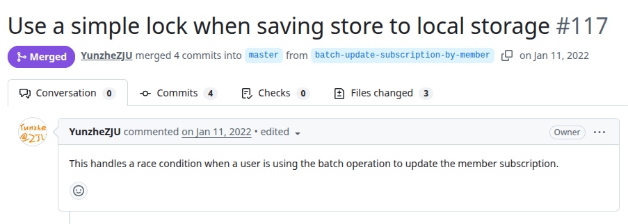
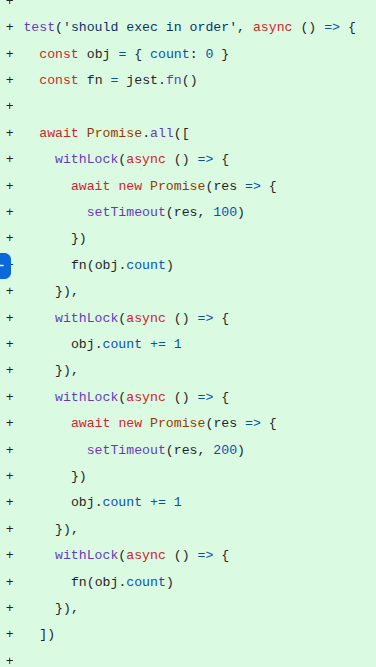
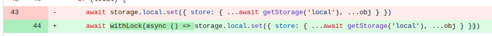

# holo-schedule
PR URL: https://github.com/YunzheZJU/holo-schedule/pull/117

## Pull Request Title and Description


## Pull Request Code




## Our Pattern Classification
Stabilization Race:

## Wang Pattern Classification
Order Violation:

## Setup
```
git clone https://github.com/YunzheZJU/holo-schedule.git
cd holo-schedule/
git checkout -f 43f8670b6075e3dd70e7ccf13a46c6e7267bae0a

nvm use 18
yarn
yarn run web-ext:build

yarn run test


```

## Reported flaky tests
```
npx jest projects/holo-schedule/src/background/store/store.test.js -t "should subscribe live" --coverage=false
```

## Utlized config on run-tests.py
```
# ============= CONFIGS =============
PROJECT_ROOT = "projects/holo-schedule"
LOG_DIRECTORY = "PRs/pr727/logs_holo"
TOTAL_RUNS = 1000
LOG_INTERVAL = 20

COMMAND = [
    'npx', 'jest', 
    'projects/holo-schedule/src/background/store/store.test.js', '-t',
    'should subscribe live'
]
# ===================================
```