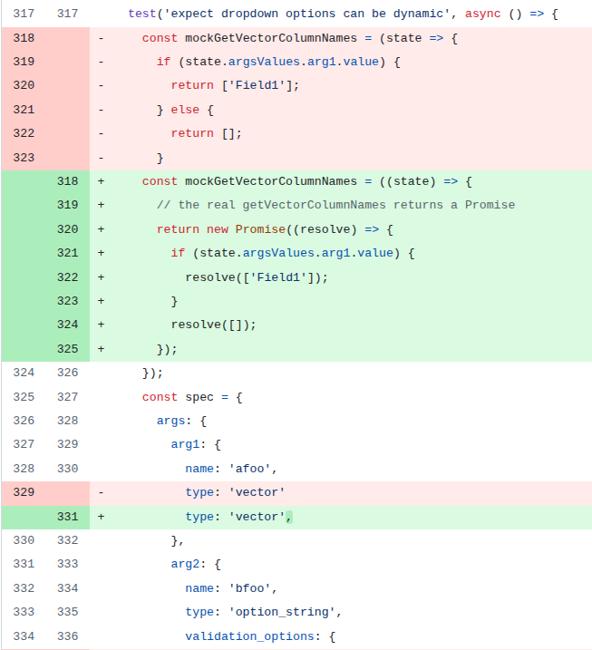

# Invest-workbench
PR URL: https://github.com/natcap/invest-workbench/pull/156

## Pull Request Title and Description


## Pull Request Code



## Description
The problem occurs when asynchronous functions continue executing after the React component has already been unmounted. These functions eventually call `setState`, which is no longer valid once the component has been removed from the DOM, leading to errors such as:
```
Warning: Can't perform a React state update on an unmounted component.
```
The fix introduces a guard (`this._isMounted`) to ensure that `setState` is only invoked if the component is still mounted.

## Validation Between the Authors
<table>
  <thead>
    <tr>
      <th align="left">Researcher</th>
      <th align="left">Classification</th>
      <th align="left">Bug Pattern</th>
      <th align="left">Rationale</th>
    </tr>
  </thead>
  <tbody>
    <tr>
      <td rowspan="2"><b>R1</b></td>
      <td>Wang</td>
      <td>Order Violation</td>
      <td>The intended sequence was for the component’s state to be updated before the component’s unmount.</td>
    </tr>
    <tr>
      <td>Our</td>
      <td><s>Stabilization Race</s><br><br><b>[After conflict resolution]</b><br>Lifecycle Race</td>
      <td><s>The test environment could trigger a component unmount if other asynchronous tasks did not stabilize correctly, leading to state updates on an unmounted component.</s><br><br>The race occurs between the lifecycle events of the completion of asynchronous tasks in a component and its unmounting.</td>
    </tr>
    <tr>
      <td rowspan="2"><b>R2</b></td>
      <td>Wang</td>
      <td>Order Violation</td>
      <td>The intended order is violated, as setState is called after the component is unmounted.</td>
    </tr>
    <tr>
      <td>Our</td>
      <td>Lifecycle Race</td>
      <td>It is more lifecycle as there is no wait related. It is a violation of the lifecycle protocol.</td>
    </tr>
  </tbody>
</table>

## Setup
```
git clone https://github.com/natcap/invest-workbench.git
cd invest-workbench
git checkout -f af7a87b1a07141962a302337540430b181417d09

nvm use 14
npm install
npm run test
```

## Reported flaky tests
```
npx jest tests/renderer/setuptab.test.js -t "expect dropdown options can be dynamic" --coverage=false
```

## Utlized config on run-tests.py
```
# ============= CONFIGS =============
PROJECT_ROOT = "projects/invest-workbench"
LOG_DIRECTORY = "PRs/pr572/logs_invest"
TOTAL_RUNS = 1000
LOG_INTERVAL = 20

COMMAND = [
    'npx', 'jest', 
    'tests/renderer/setuptab.test.js', '-t',
    'expect dropdown options can be dynamic', '--coverage=false'
]
# ===================================
```