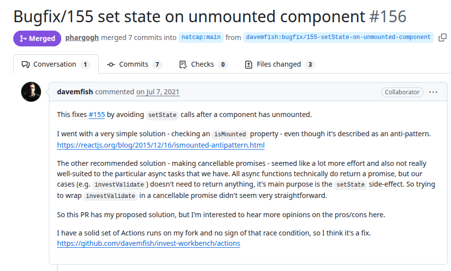
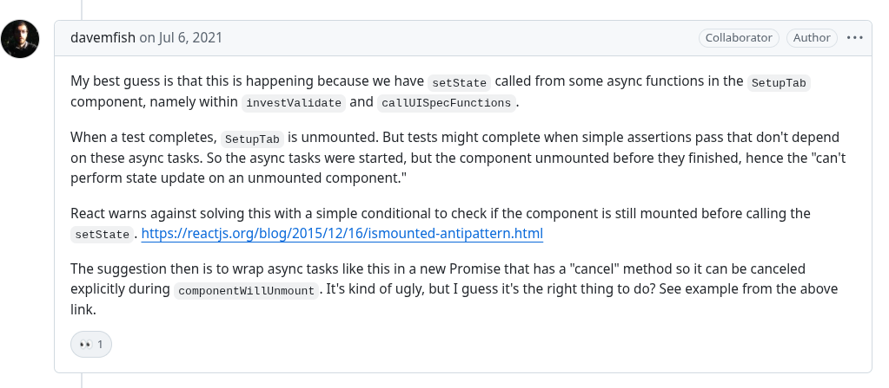
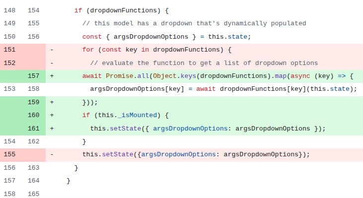

# Invest-workbench
PR URL: https://github.com/natcap/invest-workbench/pull/156

## Pull Request Title and Description



## Pull Request Code


## Our Pattern Classification
Stabilization Race:

## Wang Pattern Classification
Order Violation:

## Setup
```
git clone https://github.com/natcap/invest-workbench.git
cd invest-workbench
git checkout -f af7a87b1a07141962a302337540430b181417d09

nvm use 14
npm install
npm run test
```

## Reported flaky tests
```
npx jest tests/renderer/setuptab.test.js -t "expect dropdown options can be dynamic" --coverage=false
```

## Utlized config on run-tests.py
```
# ============= CONFIGS =============
PROJECT_ROOT = "projects/invest-workbench"
LOG_DIRECTORY = "PRs/pr572/logs_invest"
TOTAL_RUNS = 1000
LOG_INTERVAL = 20

COMMAND = [
    'npx', 'jest', 
    'tests/renderer/setuptab.test.js', '-t',
    'expect dropdown options can be dynamic', '--coverage=false'
]
# ===================================
```