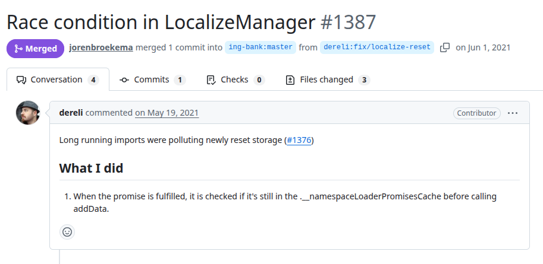
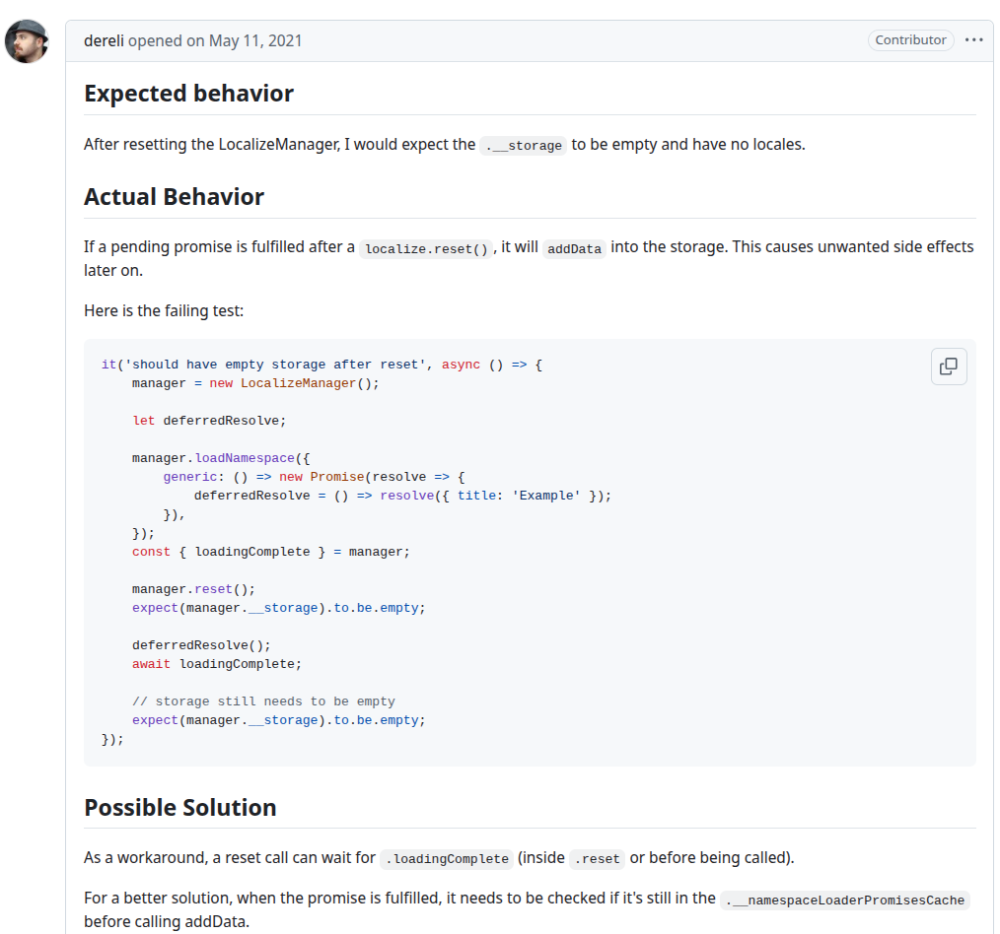
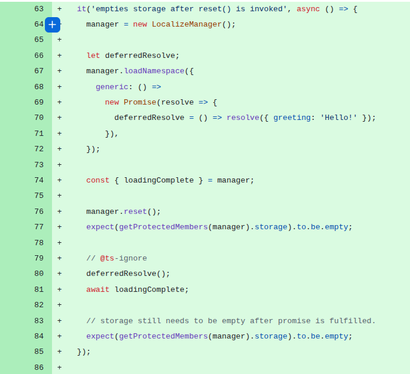

# lion
PR: https://github.com/ing-bank/lion/pull/1387

## Pull Request Title and Description



## Pull Request Code



## Description
In this test, the `LocalizeManager` begins an asynchronous operation via `loadNamespace`, which triggers a promise responsible for fetching and adding localization data. However, before this asynchronous operation completes, `manager.reset()` is invoked, clearing the internal storage and resetting the component’s state. The race occurs because the previously initiated asynchronous operation may still be in flight, and proceeds to add data to the storage after the reset. 

## Validation Between the Authors
<table>
  <thead>
    <tr>
      <th align="left">Researcher</th>
      <th align="left">Classification</th>
      <th align="left">Bug Pattern</th>
      <th align="left">Rationale</th>
    </tr>
  </thead>
  <tbody>
    <tr>
      <td rowspan="2"><b>R1</b></td>
      <td>Wang</td>
      <td>Order Violation</td>
      <td>The intended order was for the namespace data loading to finish before the manager reset, or, for the manager rest to invalidate asynchronous loading operations that happened after the reset.</td>
    </tr>
    <tr>
      <td>Our</td>
      <td>Lifecycle Race</td>
      <td>The asynchronous data loading of a manager can continue to execute and populate the storage even after a reset() call has initiated a teardown, leading to an inconsistent state in storage.</td>
    </tr>
    <tr>
      <td rowspan="2"><b>R2</b></td>
      <td>Wang</td>
      <td>Order Violation</td>
      <td>The code unexpectedly violates the order expected by the dev.</td>
    </tr>
    <tr>
      <td>Our</td>
      <td>Lifecycle Race</td>
      <td>The race execution may violate the lifecycle order expected by the dev.</td>
    </tr>
  </tbody>
</table>

## Setup
```

```