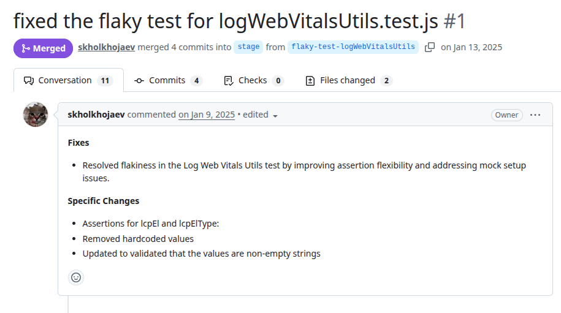
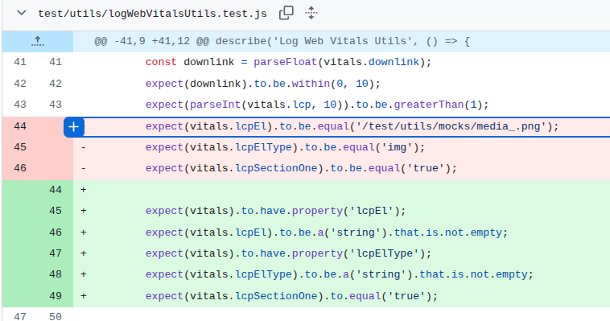

# Milo
PR: https://github.com/skholkhojaev/milo/pull/1

## Pull Request Title and Description


## Pull Request Code


## Description
This test validates metrics related to LCP (Largest Contentful Paint), such as `lcpEl`, which depend on asynchronous browser rendering behavior and the timing of performance measurement collection. Originally, the test assumed a deterministic rendering outcome by asserting exact hardcoded values (an image path). However, the measured element could vary depending on timing and execution environment, leading to intermittent failures.

## Validation Between the Authors
<table>
  <thead>
    <tr>
      <th align="left">Researcher</th>
      <th align="left">Classification</th>
      <th align="left">Bug Pattern</th>
      <th align="left">Rationale</th>
    </tr>
  </thead>
  <tbody>
    <tr>
      <td rowspan="2"><b>R1</b></td>
      <td>Wang</td>
      <td>Order Violation</td>
      <td>The intended order was for the asynchronous page rendering to complete and stabilize before the measurements were collected and asserted.</td>
    </tr>
    <tr>
      <td>Our</td>
      <td>Stabilization Race</td>
      <td>Web Vitals’ Largest Contentful Paint (LCP) measurements are captured before the UI has fully rendered and stabilized.</td>
    </tr>
    <tr>
      <td rowspan="2"><b>R2</b></td>
      <td>Wang</td>
      <td>Order Violation</td>
      <td>The assertions assume that the visual component will be ready, but sometimes it is not. Violate the order expected by the dev.</td>
    </tr>
    <tr>
      <td>Our</td>
      <td>Stabilization Race</td>
      <td>Use some resources before it is ready.</td>
    </tr>
  </tbody>
</table>


<br><br>
Obs: This PR was merged into a test branch, the merge in the used branch (stage) was made here: https://github.com/skholkhojaev/milo/commit/b1351a6df6de10659dad4dba7bb4a9ade8e5b838
commit history: https://github.com/skholkhojaev/milo/commits/stage/?since=2025-01-13&until=2025-01-15


## Setup Projeto
```
git clone https://github.com/skholkhojaev/milo.git
cd milo/
git checkout -f 6718d230085d08935b73fb4c43499cb461f52b60 # Versao antes do fix

# Steps according to readme.md (na verdade, esses passos aparentam não ser totalmente essenciais)
sudo npm install -g @adobe/aem-cli
In a terminal, run "aem up" in this repo's folder.

nvm use 20
npm install

```

## Reported flaky tests
```
npm run test:file -- test/utils/logWebVitalsUtils.test.js
npm run test:file -- test/utils/logWebVitals.test.js

ou
npx wtr --config ./web-test-runner.config.mjs --node-resolve --port=2000 test/utils/logWebVitalsUtils.test.js
npx wtr --config ./web-test-runner.config.mjs --node-resolve --port=2000 test/utils/logWebVitals.test.js
```

## Utlized config on run-tests.py
```
# ============= CONFIGS =============
PROJECT_ROOT = "projects/milo"
LOG_DIRECTORY = "PRs/pr1640/logs_milo"
TOTAL_RUNS = 1000
LOG_INTERVAL = 20

COMMAND = [
    'npx', 'wtr', 
    '--config', './web-test-runner.config.mjs',
    '--node-resolve', '--port=2000',
    'test/utils/logWebVitalsUtils.test.js'
]
# ===================================
```