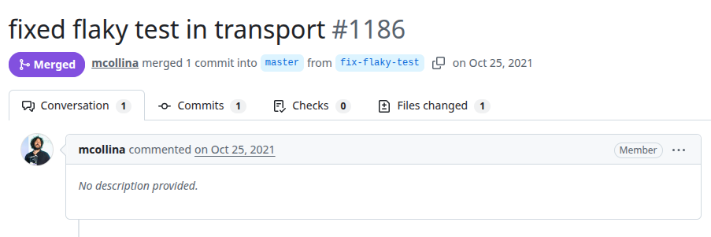
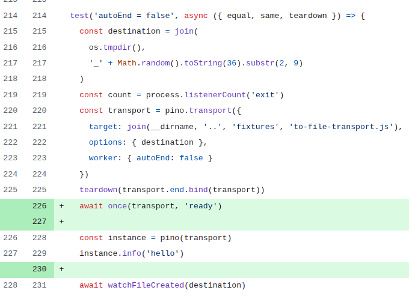

# Pino
PR URL: https://github.com/pinojs/pino/pull/1186

## Pull Request Title and Description


## Pull Request Code


## Description
In the original test, the transport instance is created and used (`instance.info('hello')`) without ensuring that it has fully completed its initialization phase. Since transport setup (including worker initialization and event binding) is asynchronous, there exists a race condition between the transport becoming ready and the test invoking operations on it. The fix introduces `await once(transport, 'ready')`.

## Validation Between the Authors
<table>
  <thead>
    <tr>
      <th align="left">Researcher</th>
      <th align="left">Classification</th>
      <th align="left">Bug Pattern</th>
      <th align="left">Rationale</th>
    </tr>
  </thead>
  <tbody>
    <tr>
      <td rowspan="2"><b>R1</b></td>
      <td>Wang</td>
      <td>Order Violation</td>
      <td>The intended order was for the asynchronous resource teardown to be completed before the new instance initialization.</td>
    </tr>
    <tr>
      <td>Our</td>
      <td>Lifecycle Race</td>
      <td>The asynchronous transport teardown might not complete before the new instance initialization, requiring explicit synchronization with ‘ready’ to ensure the correct instance initialization.</td>
    </tr>
    <tr>
      <td rowspan="2"><b>R2</b></td>
      <td>Wang</td>
      <td>Order Violation</td>
      <td>The object is used before the event ‘ready’ is emitted.</td>
    </tr>
    <tr>
      <td>Our</td>
      <td>Lifecycle Race</td>
      <td>The order of events in the object is not respected.</td>
    </tr>
  </tbody>
</table>

## Setup
```
git clone https://github.com/pinojs/pino.git
cd pino
git checkout -f e5f17ae4dc1b46c33da16d9e1e5f817a2bacfc7c

nvm use 18
npm install
npm run test-ci
```
go to test/transport/core.test.js and comment the following line: (line 226)
```
  await once(transport, 'ready')
```

## Reported flaky tests
```
npx tap test/transport/core.test.js -g "autoEnd = false" --no-coverage
```

## Utlized config on run-tests.py
```
# ============= CONFIGS =============
PROJECT_ROOT = "projects/pino"
LOG_DIRECTORY = "PRs/pr673/logs_pino"
TOTAL_RUNS = 1000
LOG_INTERVAL = 20

COMMAND = [
    'npx', 'tap', 
    'test/transport/core.test.js',
    '-g', 'autoEnd = false',
    '--no-coverage'
]
# ===================================
```

to use with nacd, nvm use 22