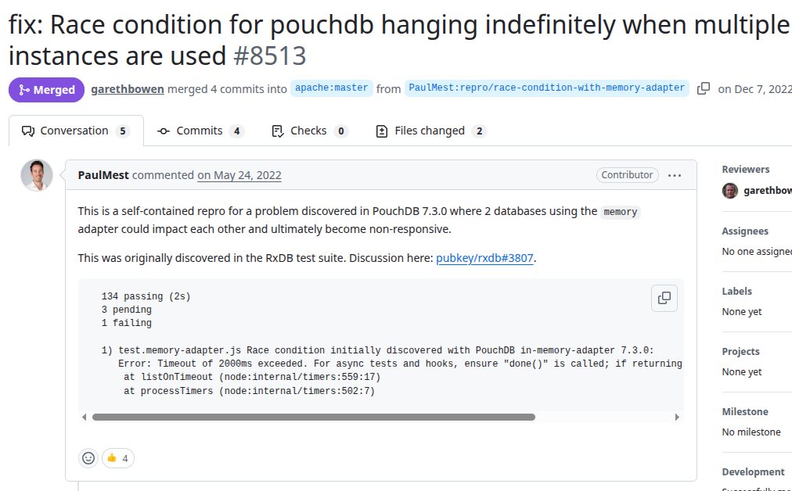
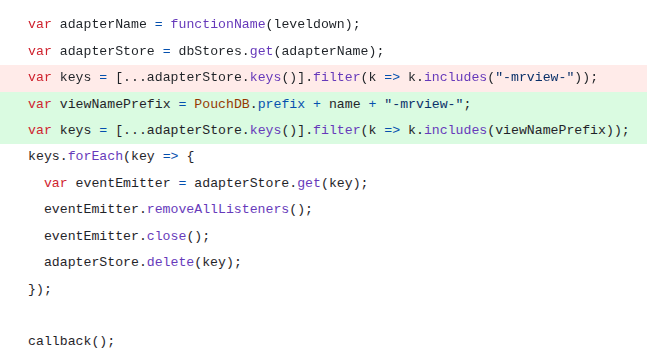

# Pouchdb
PR URL: https://github.com/pouchdb/pouchdb/pull/8513

## Pull Request Title and Description


## Pull Request Code


## Our Pattern Classification
Stabilization Race:

## Wang Pattern Classification
Order Violation:

## Setup
```
git clone https://github.com/pouchdb/pouchdb.git
cd pouchdb
git checkout -f 24157fcf27ffa429c248770ee7997a46f3696117

nvm use 12
npm install

docker run -e COUCHDB_USER=admin -e COUCHDB_PASSWORD=password -it --name my-couchdb -p 5984:5984 couchdb:latest

(open new console tab)
npm test


(to undo the fix made by the authors:)
go to projects/pouchdb/packages/node_modules/pouchdb-adapter-leveldb-core/src/index.js
comment the following lines:

var viewNamePrefix = PouchDB.prefix + name + "-mrview-";
var keys = [...adapterStore.keys()].filter(k => k.includes(viewNamePrefix));

Add the following line:
var keys = [...adapterStore.keys()].filter(k => k.includes("-mrview-"));

```

## Reported flaky tests
```
npx mocha tests/unit/test.memory-adapter.js 
```

## Using NACD
```
nvm use 22
nacd plain2 npx mocha tests/unit/test.memory-adapter.js 
```

## Utlized config on run-tests.py
```
# ============= CONFIGS =============
PROJECT_ROOT = "projects/pouchdb"
LOG_DIRECTORY = "PRs/pr827/logs_pouchdb"
TOTAL_RUNS = 1000
LOG_INTERVAL = 20

COMMAND = [
    'npx', 'mocha', 
    'tests/unit/test.memory-adapter.js'
]
# ===================================
```