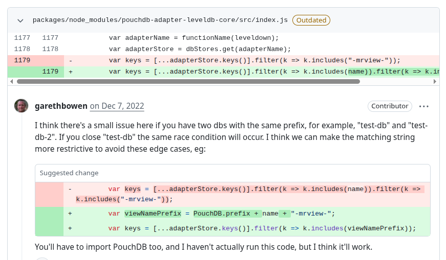

# Pouchdb
PR URL: https://github.com/pouchdb/pouchdb/pull/8513

## Pull Request Title and Description




## Pull Request Code


## Description
In this case, two independent PouchDB instances (`pouch1` and `pouch2`) are created and used concurrently with the in-memory adapter. Although each instance operates correctly in isolation, running them in parallel leads to interference between their internal lifecycle processes. Specifically, when one instance is closed or destroyed (`pouch1.close()` or `pouch2.destroy()`), it inadvertently affects shared internal resources (such as event listeners or adapter-level state), impacting the other instance.
This results in a situation where one database instance is left waiting for events or operations that will never complete because its dependencies have been prematurely torn down by another instance. Consequently, the system hangs and becomes unresponsive, leading to test timeouts.

## Validation Between the Authors
<table>
  <thead>
    <tr>
      <th align="left">Researcher</th>
      <th align="left">Classification</th>
      <th align="left">Bug Pattern</th>
      <th align="left">Rationale</th>
    </tr>
  </thead>
  <tbody>
    <tr>
      <td rowspan="2"><b>R1</b></td>
      <td>Wang</td>
      <td>Starvation</td>
      <td>If the race condition occurs and the event listeners of a database instance are removed by the teardown of another database, the execution will hang, preventing the processing of the assertions and the completion of the test.</td>
    </tr>
    <tr>
      <td>Our</td>
      <td>Lifecycle Race</td>
      <td>The teardown logic of one database instance can accidentally remove event listeners of another instance because of the same prefix.</td>
    </tr>
    <tr>
      <td rowspan="2"><b>R2</b></td>
      <td>Wang</td>
      <td>Starvation</td>
      <td>A second instance of a in memory db can starve due to a prior one.</td>
    </tr>
    <tr>
      <td>Our</td>
      <td>Lifecycle Race</td>
      <td>Bug makes two different instances to be impacted (in its lifecycle) by the prior one.</td>
    </tr>
  </tbody>
</table>

## Setup
```
git clone https://github.com/pouchdb/pouchdb.git
cd pouchdb
git checkout -f 24157fcf27ffa429c248770ee7997a46f3696117

nvm use 12
npm install

docker run -e COUCHDB_USER=admin -e COUCHDB_PASSWORD=password -it --name my-couchdb -p 5984:5984 couchdb:latest

(open new console tab)
npm test


(to undo the fix made by the authors:)
go to projects/pouchdb/packages/node_modules/pouchdb-adapter-leveldb-core/src/index.js
comment the following lines:

var viewNamePrefix = PouchDB.prefix + name + "-mrview-";
var keys = [...adapterStore.keys()].filter(k => k.includes(viewNamePrefix));

Add the following line:
var keys = [...adapterStore.keys()].filter(k => k.includes("-mrview-"));

```

## Reported flaky tests
```
npx mocha tests/unit/test.memory-adapter.js 
```

## Using NACD
```
nvm use 22
nacd plain2 npx mocha tests/unit/test.memory-adapter.js 
```

## Utlized config on run-tests.py
```
# ============= CONFIGS =============
PROJECT_ROOT = "projects/pouchdb"
LOG_DIRECTORY = "PRs/pr827/logs_pouchdb"
TOTAL_RUNS = 1000
LOG_INTERVAL = 20

COMMAND = [
    'npx', 'mocha', 
    'tests/unit/test.memory-adapter.js'
]
# ===================================
```