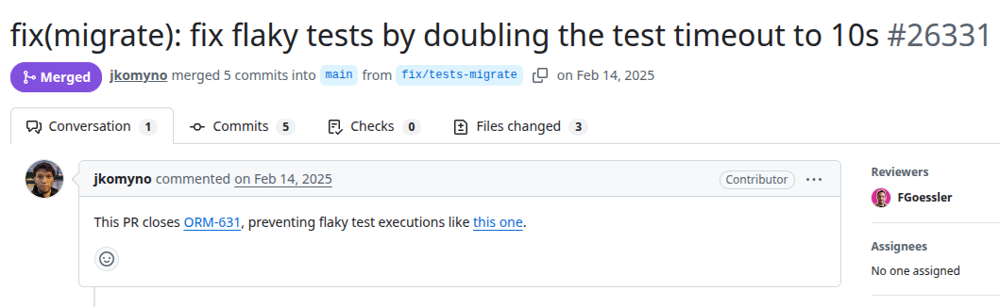
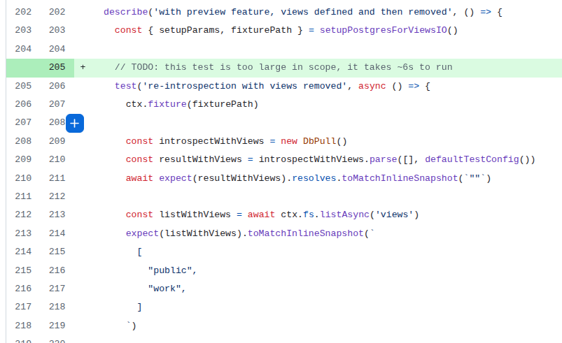

# Prisma
PR URL: https://github.com/prisma/prisma/pull/26331

## Pull Request Title and Description


## Pull Request Code


## Description
The flaky behavior occurs because database setup and query execution may take variable amounts of time depending on external factors such as system load, I/O performance, or infrastructure. In some executions, these operations exceed the default test timeout, causing tests to fail even though the logic itself is correct.
The fix (doubling the test timeout to 10 seconds) does not change the underlying logic or synchronization but instead accommodates the variability of the external system.

## Validation Between the Authors
<table>
  <thead>
    <tr>
      <th align="left">Researcher</th>
      <th align="left">Classification</th>
      <th align="left">Bug Pattern</th>
      <th align="left">Rationale</th>
    </tr>
  </thead>
  <tbody>
    <tr>
      <td rowspan="2"><b>R1</b></td>
      <td>Wang</td>
      <td><s>Starvation</s><br><br><b>[After conflict resolution]</b><br>Order Violation</td>
      <td><s>The database setup tasks can exceed the test runner’s timeout, preventing the processing and completion of the remaining code in the test.</s><br><br>The intended order is for all database setup and operations to finish before the test timeout limit, but due to variation in execution time, the test may terminate before the database operations.</td>
    </tr>
    <tr>
      <td>Our</td>
      <td>External Nondeterminism</td>
      <td>The test's external database operations occasionally exceed the test runner’s timeout, causing the test to fail independently of the internal JavaScript code logic.</td>
    </tr>
    <tr>
      <td rowspan="2"><b>R2</b></td>
      <td>Wang</td>
      <td>Order violation</td>
      <td>If it starves, more timeout will not be enough. Order violation - the test runner ends the test before all tasks are performed.<br><br>[After conflict resolution] Agreed in Order Violation.</td>
    </tr>
    <tr>
      <td>Our</td>
      <td>External Nondeterminism</td>
      <td>It depends on the external system performance (along with concurrent behavior) to occur.</td>
    </tr>
  </tbody>
</table>

## Setup
```
git clone https://github.com/prisma/prisma.git
cd prisma
git checkout -f d7415932e4a7149f1f4758b3fd573c4ada44dc31

nvm use 18
pnpm i
pnpm build


cd docker (other tab)
docker compose up postgres 

cd packages/migrate
pnpm test
```

## Reported flaky tests
```
pnpm test src/__tests__/DbPull/postgresql-views.test.ts -t "postgresql-views with preview feature, views defined and then removed re-introspection with views removed"

(if other tests are executing, use test.only on the selected test)
```

## Utlized config on run-tests.py
```
# ============= CONFIGS =============
PROJECT_ROOT = "projects/prisma/packages/migrate"
LOG_DIRECTORY = "PRs/pr1667/logs_prisma"
TOTAL_RUNS = 1000
LOG_INTERVAL = 20

COMMAND = [
    'pnpm', 'test', 
    'src/__tests__/DbPull/postgresql-views.test.ts',
    '-t', 'postgresql-views with preview feature, views defined and then removed re-introspection with views removed'
]
# ===================================
```