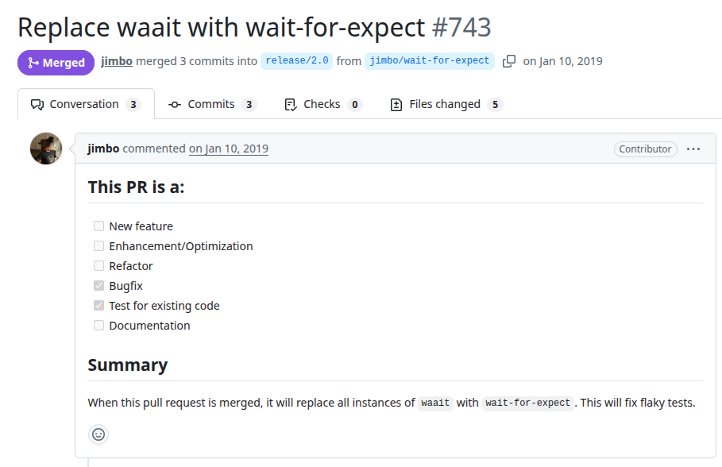
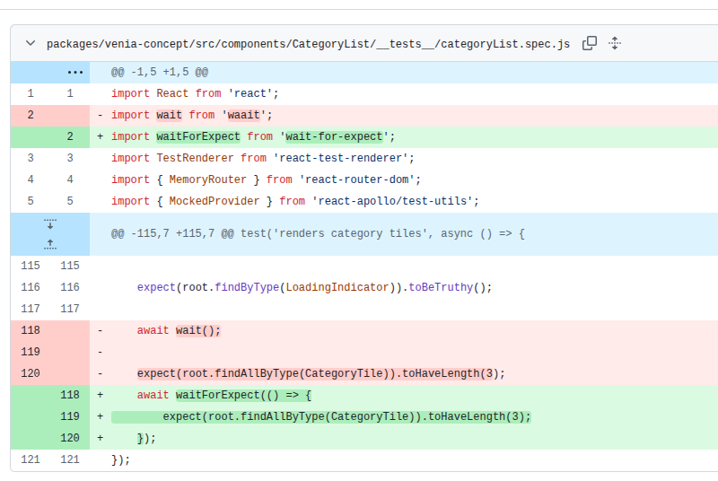

# Pwa-studio
PR: https://github.com/magento/pwa-studio/pull/743

## Pull Request Title and Description


## Pull Request Code


## Description
In the original test, the use of `await wait()` (from the `waait` library) introduces a minimal delay (similar to `setTimeout(0)`), allowing only a single event loop tick before proceeding. However, this approach does not guarantee that all asynchronous rendering and data-fetching operations, especially those involving React have completed. As a result, the test may execute assertions (checking the number of `CategoryTile` components) before the component has finished rendering, leading to flaky outcomes. The fix replaces this approach with `wait-for-expect`, which repeatedly evaluates the assertion until it passes or a timeout is reached.

## Validation Between the Authors
<table>
  <thead>
    <tr>
      <th align="left">Researcher</th>
      <th align="left">Classification</th>
      <th align="left">Bug Pattern</th>
      <th align="left">Rationale</th>
    </tr>
  </thead>
  <tbody>
    <tr>
      <td rowspan="2"><b>R1</b></td>
      <td>Wang</td>
      <td>Order Violation</td>
      <td>The intended ordering was for the component rendering and fetching to be completed before the assertions on the output.</td>
    </tr>
    <tr>
      <td>Our</td>
      <td>Stabilization Race</td>
      <td>The delay introduced by “await wait()” was insufficient to ensure that the component’s asynchronous rendering and fetching have fully stabilized before assertions.</td>
    </tr>
    <tr>
      <td rowspan="2"><b>R2</b></td>
      <td>Wang</td>
      <td>Order Violation</td>
      <td>The dev intended order is the component be rendered before asserting.</td>
    </tr>
    <tr>
      <td>Our</td>
      <td>Stabilization Race</td>
      <td>Use some resource before it is ready.</td>
    </tr>
  </tbody>
</table>


## Setup Projeto
```
git clone https://github.com/magento/pwa-studio.git
cd pwa-studio
git checkout b6f4118b011a92252504d4edaa6596748d776d7d # versão anterior ao fix
nvm use 10 # segundo arquivo pwa-studio/.circleci/config.yml
npm install
npm test # jest
```

## Reported flaky tests
```
npx jest packages/venia-concept/src/components/CategoryList/__tests__/categoryList.spec.js -t "renders category tiles" --coverage=false
npx jest packages/venia-concept/src/components/CreateAccount/__tests__/createAccount.spec.js -t "executes validators on submit" --coverage=false
npx jest packages/venia-concept/src/components/CreateAccount/__tests__/createAccount.spec.js -t "calls onSubmit if validation passes" --coverage=false
npx jest packages/venia-concept/src/components/Navigation/__tests__/categoryTree.spec.js -t "child node correctly sets new root and parent ids" --coverage=false
```

