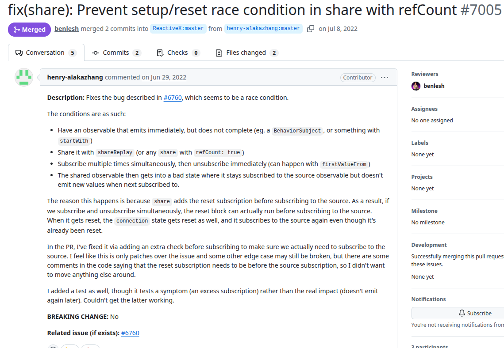
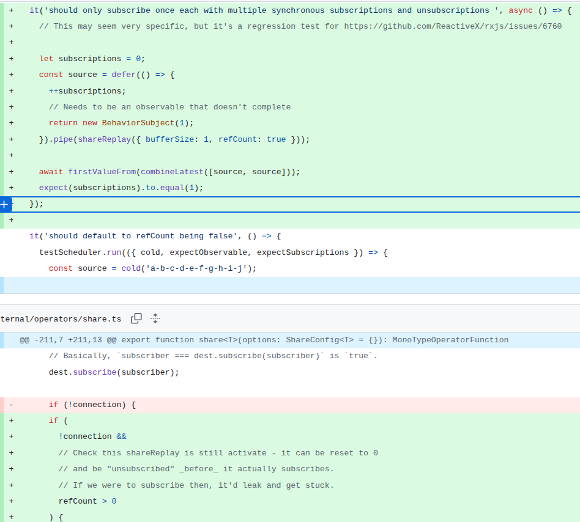

# Rxjs
PR URL: https://github.com/ReactiveX/rxjs/pull/7005

## Pull Request Title and Description


## Pull Request Code


## Our Pattern Classification
Stabilization Race:

## Wang Pattern Classification
Order Violation:

## Setup
```
git clone https://github.com/ReactiveX/rxjs.git
cd rxjs
git checkout -f 5d4c1d9a37b1347217223adb0d9e166fd85f67a9

nvm use 16

<!-- yarn install --frozen-lockfile
yarn nx run-many -t build lint test --exclude=rxjs.dev
yarn workspace rxjs test -->

npm ci
npm test
```

go to src/internal/operators/share.ts and change:

```
if (
    !connection &&
    // Check this shareReplay is still activate - it can be reset to 0
    // and be "unsubscribed" _before_ it actually subscribes.
    // If we were to subscribe then, it'd leak and get stuck.
    refCount > 0
) {
```
to
´´´
if (!connection) {
´´´

## Reported flaky tests
```
<!-- yarn workspace rxjs test -g "should only subscribe once each with multiple synchronous subscriptions and unsubscriptions" -R spec -->

npx cross-env TS_NODE_PROJECT=tsconfig.mocha.json mocha --config spec/support/.mocharc.js \"spec/operators/shareReplay-spec.ts\" -R spec -g "should only subscribe once each with multiple synchronous subscriptions and unsubscriptions"
```

## Utlized config on run-tests.py
```
# ============= CONFIGS =============
PROJECT_ROOT = "projects/rxjs"
LOG_DIRECTORY = "PRs/pr857/logs_rxjs"
TOTAL_RUNS = 1000
LOG_INTERVAL = 20

COMMAND = [
    'npx', 'cross-env', 'TS_NODE_PROJECT=tsconfig.mocha.json', 'mocha',
    '--config', 'spec/support/.mocharc.js', '\"spec/operators/shareReplay-spec.ts\"',
    '-R', 'spec',
    '-g', 'should only subscribe once each with multiple synchronous subscriptions and unsubscriptions'
]
# ===================================
```