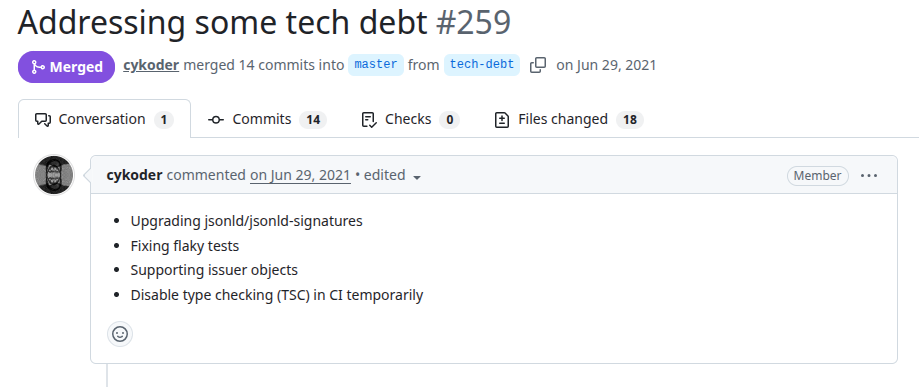
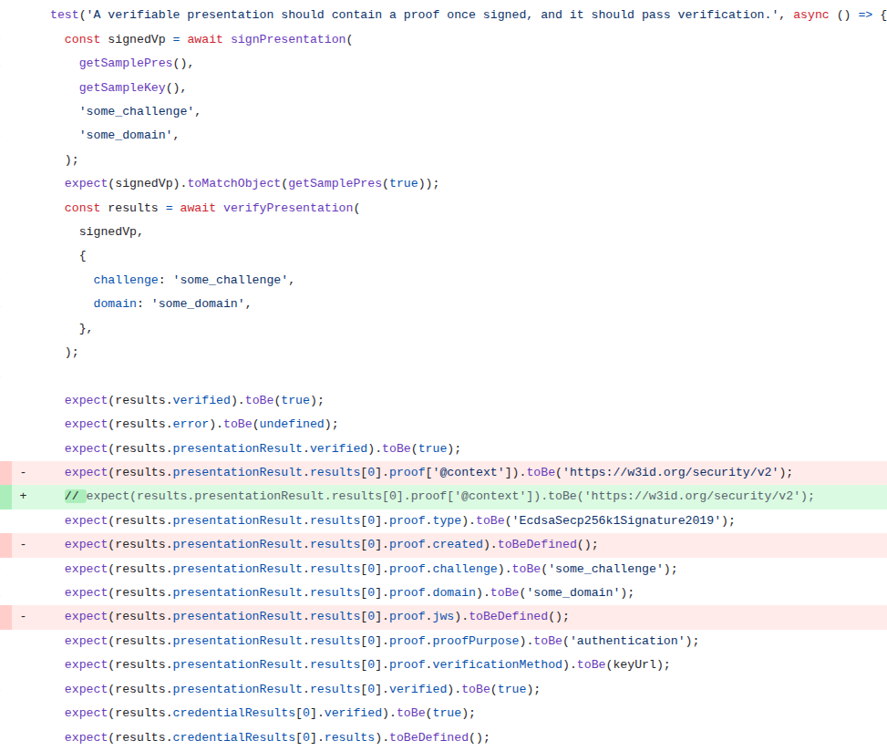

# Sdk
PR URL: https://github.com/docknetwork/sdk/pull/259

## Pull Request Title and Description


## Pull Request Code


## Our Pattern Classification
Stabilization Race:

## Wang Pattern Classification
Order Violation:

## Setup
```
git clone https://github.com/docknetwork/sdk.git
cd sdk
git checkout -f 8a38f9952a53e1b2f57b6ee8589ed02b77d04723
<!-- ae0ef8b2686aa65c42a3b0f1bd8ac758b5276c22 -->

nvm use 14
npm i yarn
npx yarn
npx yarn install
npx yarn build
npx yarn test
npx yarn test-with-node

```

## Reported flaky tests
```
npx jest tests/unit/issuing.test.js -t "Verifiable Credential Verification The sample signed credential should pass verification." --coverage=false
```

## Utlized config on run-tests.py
```
# ============= CONFIGS =============
PROJECT_ROOT = "projects/sdk"
LOG_DIRECTORY = "PRs/pr560/logs_sdk"
TOTAL_RUNS = 1000
LOG_INTERVAL = 20

COMMAND = [
    'npx', 'jest', 
    'tests/unit/issuing.test.js', '-t',
    'Verifiable Credential Verification The sample signed credential should pass verification.', '--coverage=false'
]
# ===================================
```