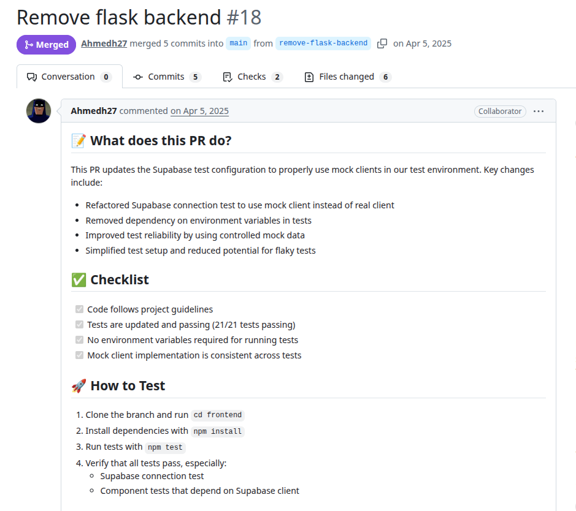
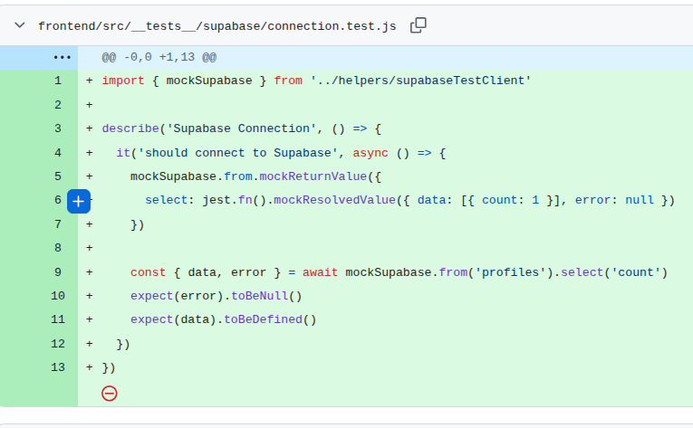

# Stockify
PR URL: https://github.com/ATMmonitor667/Stockify/pull/18

## Pull Request Title and Description


## Pull Request Code


## Our Pattern Classification
Stabilization Race:

## Wang Pattern Classification
Order Violation:

## Setup
```
git clone https://github.com/ATMmonitor667/Stockify.git
cd Stockify
git checkout -f 3edfa79a96fcfb196afdbf500f07dc2119f72115

nvm use 20
cd frontend
npm install
npm run test
```

## Reported flaky tests
```
npx jest frontend/src/__tests__/supabase/connection.test.js -t "Supabase Connection" --coverage=false
```

## Utlized config on run-tests.py
```
# ============= CONFIGS =============
PROJECT_ROOT = "projects/Stockify/frontend"
LOG_DIRECTORY = "PRs/pr1712/logs_stockify"
TOTAL_RUNS = 1000
LOG_INTERVAL = 20

COMMAND = [
    'npx', 'jest', 
    'frontend/src/__tests__/supabase/connection.test.js',
    '-t', 'Supabase Connection',
    '--coverage=false'
]
# ===================================
```