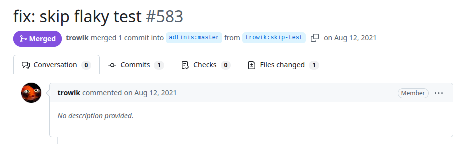
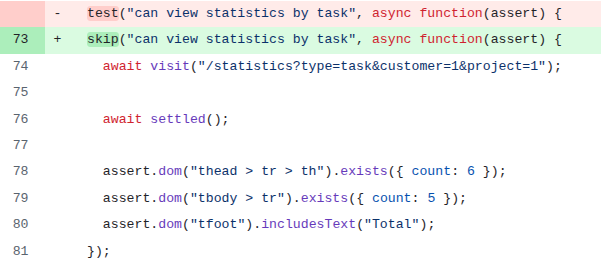

# Timed-frontend
PR URL: https://github.com/adfinis/timed-frontend/pull/583

## Pull Request Title and Description


## Pull Request Code


## Description
In this test, the use of `await settled()` is intended to ensure that all pending asynchronous operations have completed. However, in practice, `settled()` is not always sufficient to guarantee that all DOM updates have fully propagated. As evidenced by the intermittent failure (382/1000 runs), the test sometimes evaluates the DOM before the `<tbody>` rows are rendered, resulting in fewer elements than expected.

```
Environment: test
cleaning up...
Built project successfully. Stored in "/home/pedroubuntu/Desktop/FAPESP/flaky-finder/projects/timed-frontend/tmp/class-tests_dist-lCcyxX01.tmp".
not ok 1 Chrome 139.0 - [484 ms] - Acceptance | statistics: can view statistics by task
    ---
        actual: >
            Element tbody > tr does not exist
        expected: >
            Element tbody > tr exists 5 times
        stack: >
                at DOMAssertions.exists (http://localhost:7357/assets/test-support.js:9252:16)
                at DOMAssertions.exists (http://localhost:7357/assets/test-support.js:9528:18)
                at Object.<anonymous> (http://localhost:7357/assets/tests.js:1247:32)
        message: >
            Element tbody > tr exists 5 times
        negative: >
            false
        browser log: |
    ...

1..1
# tests 1
# pass  0
# skip  0
# fail  1
```

## Validation Between the Authors
<table>
  <thead>
    <tr>
      <th align="left">Researcher</th>
      <th align="left">Classification</th>
      <th align="left">Bug Pattern</th>
      <th align="left">Rationale</th>
    </tr>
  </thead>
  <tbody>
    <tr>
      <td rowspan="2"><b>R1</b></td>
      <td>Wang</td>
      <td>Order Violation</td>
      <td>The intended order was for asynchronous UI rendering to complete before the assertions proceed.</td>
    </tr>
    <tr>
      <td>Our</td>
      <td>Stabilization Race</td>
      <td>The “await settled()” fails to ensure the UI has fully rendered and stabilized, causing the test assertion to evaluate the DOM before the the &lt;tbody&gt; rows are rendered.</td>
    </tr>
    <tr>
      <td rowspan="2"><b>R2</b></td>
      <td>Wang</td>
      <td>Order Violation</td>
      <td>The order rendering then asserts is violated.</td>
    </tr>
    <tr>
      <td>Our</td>
      <td>Stabilization Race</td>
      <td>The assertion is executed sooner.</td>
    </tr>
  </tbody>
</table>

## Setup
```
git clone https://github.com/adfinis/timed-frontend.git
cd timed-frontend
git checkout -f 559d20d882c132e19ee0c11555eadaec2fe2ed00

nvm use 14
npm install yarn
npx yarn install
npx yarn test
```

## Reported flaky tests
```
npx ember test --launch Chrome --filter="Acceptance | statistics: can view statistics by task"
```

## Utlized config on run-tests.py
```
# ============= CONFIGS =============
PROJECT_ROOT = "projects/timed-frontend"
LOG_DIRECTORY = "PRs/pr612/logs_timed"
TOTAL_RUNS = 1000
LOG_INTERVAL = 20

COMMAND = [
    'npx', 'ember', 'test', '--launch', 'Chrome', '--filter=Acceptance | statistics: can view statistics by task',
]
# ===================================
```