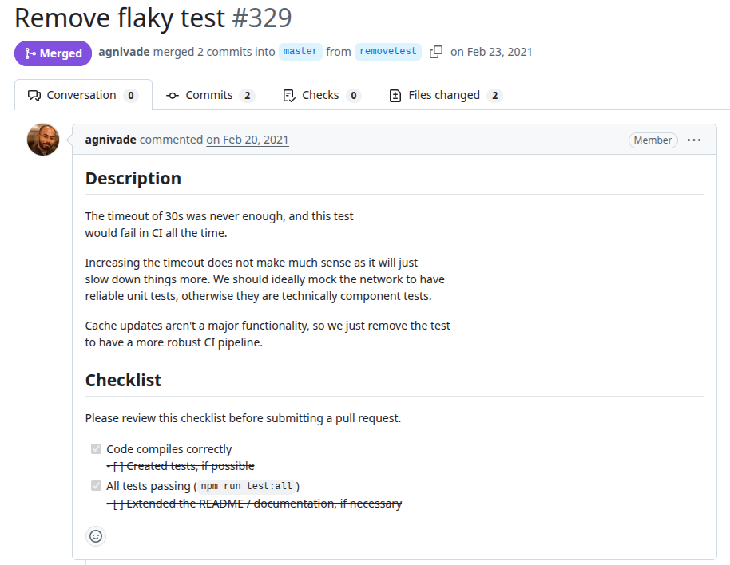
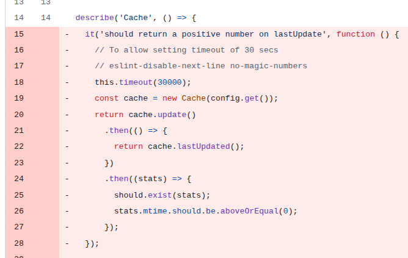

# Tldr-node-client
PR URL: https://github.com/tldr-pages/tldr-node-client/pull/329

## Pull Request Title and Description


## Pull Request Code


## Description
The test invokes `cache.update()`, which performs network and filesystem interactions. These operations are variable in duration due to external factors such as network latency, remote service responsiveness, and CI environment performance. As noted in the PR description, even a 30 second timeout was insufficient in some cases, leading to intermittent failures. The decision of the developers was to remove the test rather than increasing the timeout.

## Validation Between the Authors
<table>
  <thead>
    <tr>
      <th align="left">Researcher</th>
      <th align="left">Classification</th>
      <th align="left">Bug Pattern</th>
      <th align="left">Rationale</th>
    </tr>
  </thead>
  <tbody>
    <tr>
      <td rowspan="2"><b>R1</b></td>
      <td>Wang</td>
      <td><s>Starvation</s><br><br><b>[After conflict resolution]</b><br>Order Violation</td>
      <td><s>The high latency in cache updates can cause the exhaustion of the test time, preventing the processing of the assertions and the correct completion of the test.</s><br><br>The expected order was for the operations from cache and assertions to be completed before the 30s test timeout.</td>
    </tr>
    <tr>
      <td>Our</td>
      <td>External Nondeterminism</td>
      <td>The nondeterministic behavior arises from external dependencies in network latency during cache updates that exceeds the test runner’s 30 seconds timeout.</td>
    </tr>
    <tr>
      <td rowspan="2"><b>R2</b></td>
      <td>Wang</td>
      <td><b>[After conflict resolution]</b><br><br>Order Violation</td>
      <td>Can we say order violation? The test runner ends before it ends.<br><br><b>[After conflict resolution]</b> Agreed.</td>
    </tr>
    <tr>
      <td>Our</td>
      <td>External Nondeterminism</td>
      <td>It occurs due to external issues related to the time taken to manipulate and download files.</td>
    </tr>
  </tbody>
</table>

## Setup
```
git clone https://github.com/tldr-pages/tldr-node-client.git
cd tldr-node-client/
git checkout -f 6905454f6b9fc3fe572a5d82e90b630cc7cb530c

nvm use 22
npm install
npm test
```

## Reported flaky tests
```
npx mocha test/cache.spec.js -g "should return a positive number on lastUpdate"
```

## Utlized config on run-tests.py
```
# ============= CONFIGS =============
PROJECT_ROOT = "projects/tldr-node-client"
LOG_DIRECTORY = "PRs/pr393/logs_tldr"
TOTAL_RUNS = 1000
LOG_INTERVAL = 20

COMMAND = [
    'npx', 'mocha', 
    'test/cache.spec.js', '-g',
    'should return a positive number on lastUpdate'
]
# ===================================
```